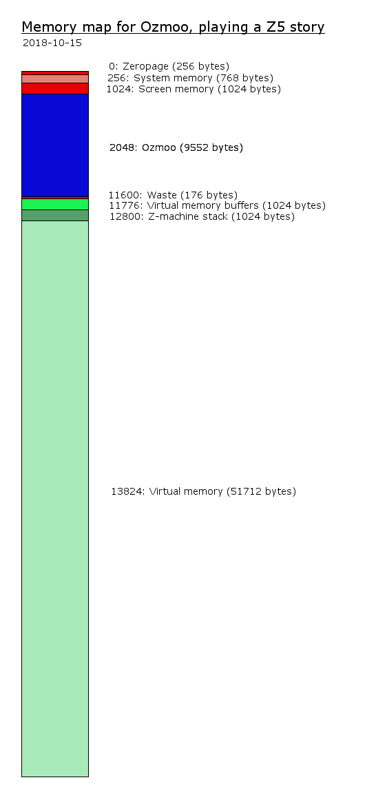

<!-- pandoc manual.md -o manual.pdf -->

# Overview

Ozmoo is a a redistributable interpreter of Infocom and Inform games that use the Z-code format, and can be used for new interactive fiction works on the Commodore 64 and similar computers.  While the old Infocom interpreters are still available, the license situation is not clear so it is risky to use in new work, especially commercial. Furthermore, some of the newer Inform-based games use features which the old Infocom interpreters on the C64 can't handle. Ozmoo is written to provide a free alternative to these concerns.

## Features

Ozmoo supports:

- Fitting a lot more text on screen than Infocom's interpreters - This is done by using all 40 columns, smart wordwrap and a MORE prompt which uses a single character.
- Embedding a custom font. Currently two fonts are included in the distribution, plus some versions for Swedish, Danish, German, Italian, Spanish and French. And you can supply your own font.
- Custom alphabets in Z-machine version 5 and 8.
- Custom character mappings, allowing for games using accented characters. Comes with predefined mappings for Swedish, Danish, German, Italian, Spanish and French.
- Custom colour schemes.
- A fully configurable secondary colour scheme (darkmode) which the player can toggle by pressing the F1 key.
- A configurable splash screen which is shown just before the game starts.
- Up to ten save slots on a save disk (and most games will get the full ten slots).
- Writing a name for each saves position.
- Building a Z-code game without virtual memory. This means the whole game must fit in RAM at once, imposing a size restriction of about 50-52 KB. A game built this way can then be played on a C64 without a diskdrive. This far, save/restore does require a diskdrive, but there may be a version with save/restore to tape in the future. Also, a game built in this mode doesn't support RESTART.
- Building a game as a d81 disk image. This means there is room for any size of game on a single disk. A d81 disk image can be used to create a disk for a 1581 drive or it can be used with an SD2IEC device or, of course, an emulator. Ozmoo uses the 1581 disk format's partitioning mechanism to protect the game data from being overwritten, which means you can safely use the game disk for game saves as well, thus eliminating the need for disk swapping when saving/restoring.
- Using an REU (Ram Expansion Unit) for caching. The REU can also be used to play a game built for a dual disk drive system with just one drive.

## Limitations

Ozmoo should be able to run most Z-code games, regardless of size (A Z-code game can be up to 512 KB in size).  However, there are some limitations:

- Ozmoo only supports version 3, 4, 5 and 8 of Z-code. This means you can't run the very first versions of Zork I and II, or the Infocom games with graphics. 
- A Z-code file always starts with a section called dynamic memory. Ozmoo will not be able to handle games with more than roughly 35 KB of dynamic memory.
- If you want to run Ozmoo on a system with a single 1541 drive (or an emulation of one), the part of the game file that is not dynamic memory can be no larger than 191.5 KB. This typically means the game file can be about 210 KB in size.
- Some Inform 6 games and pretty much all Inform 7 games will never be fast enough to be any fun on Ozmoo. In general, Infocom games are faster than Inform games.

# Quickstart

The simplest but also somewhat limited option, is to use Ozmoo Online, a web page where you can build games with Ozmoo without installing anything on your computer. Ozmoo online is located at: http://microheaven.com/ozmooonline/

The other option is to install Ozmoo on your computer. This can be done on Windows, Linux and Mac OS X. To build a game, you run something like "ruby make.rb game.z5" Add -s to make the game start in Vice when it has been built. Run make.rb without arguments to view all options.

## Dependencies

You need to install:

- Acme cross-assembler
- Exomizer file compression program (tested with 3.0.0, 3.0.1 and 3.0.2)
- Ruby (Tested with 2.4.2, but any 2.4 version should work fine)
- The Vice C64/C128/Plus4 emulator, or the Xemu MEGA65 emulator

#### Windows

Acme can be downloaded from SourceForge: https://sourceforge.net/projects/acme-crossass/

Exomizer can be downloaded from Bitbucket. The download includes binaries for Windows: https://bitbucket.org/magli143/exomizer/wiki/browse/downloads

Get WinVice from SourceForge: http://vice-emu.sourceforge.net/windows.html

You can get Ruby from RubyInstaller: https://rubyinstaller.org/

####  Linux

Acme is available on Debian/Ubuntu with:

    > sudo apt install acme

Exomizer can be downloaded from Bitbucket and compiled:

    > cd src
    > make

Vice is available on Debian/Ubuntu with:

    > sudo apt install vice

Note that you have to supply the ROM images (kernal, basic, chargen, dos1541) under /usr/lib/vice to make x64 (the C64 emulator) run. See VICE instructions for more details.

Ruby is available on Debian/Ubuntu with:

    > sudo apt install ruby

## Customizing the make script

Edit the file make.rb. At the top of the file, you need to specify paths to the Acme assembler, Exomizer, the Vice C64 emulator, and the program "c1541" which is also included in the Vice distribution.  If you are using Windows, you can ignore the section on Linux and vice versa.


## Seeing all commandline options for make.rb

At a command prompt, type "ruby make.rb"


## The basic way to build a game

At a command prompt, type "ruby make.rb mygame.z5"


## Build a game which will only consist of a single file

At a command prompt, type "ruby make.rb -P mygame.z5" to build a game which will only consist of a single file. A game created in this way does, not require a disk drive to play.


## Build a game with optimized preloaded virtual memory data

Use these step to build a game with optimized preloaded virtual memory data which will make the game as fast as possible at startup:

1. At a command prompt, type "ruby make.rb -o -s mygame.z5"

2. Play the game, performing the actions you think the player is likely to do first. Keep playing until the game halts, printing a report with lots of numbers. (You can also end it and get the report earlier by typing xxx)

3. In Vice, select Edit -> Copy from the menu

4. Create a text file (let's say you call it mygame_optimization.txt), paste the complete text you just copied from Vice into the file and save it.

5. At a command prompt, type "ruby make.rb -c mygame_optimization.txt mygame.z5"

# Build Modes

## Targets

While the main target for Ozmoo is the Commodore 64, it is possible to target
other similar computers. make.rb takes a -t:target argument to enable such
future extensions, but currently only c64 is supported, and the rest of this
documents is c64 specific.


## Drives and devices

A game built using Ozmoo is placed on one or more disks. These disks can then be used in different disk drive devices attached to the C64. The device numbers which can be used are 8, 9, 10, 11. Two different story disks can not use the same device number.


## List of build modes

Notes: 

* Preloading means some or all of memory is filled with suitable parts of the story file, by loading this content from a file as the game starts. Using preloading speeds up game start for many players since this initial loading sequence can use any fastloader the user may have enabled. It also means gameplay is as fast as it gets, right from the start.

* Less RAM available for virtual memory system: This means a smaller part of C64 memory can be used for virtual memory handling, which means the game will need to load sectors from disk more often. This will of course slow the game down.

### Modes not requiring a disk drive for play:

P: _Program file_

- Story file size < ~51 KB: Using full amount of RAM.
- Story file size < ~40 KB: You may use flag -r to only use RAM up to $CFFF. This means all RAM can be accessed directly without buffers, which makes the interpreter smaller and the game faster.

Disks used:

- Boot / Story disk. This contains a single file, which may be moved to any other medium, like another disk image or a tape image.


### Modes requiring a single 1541 drive for play:

S1: _Single 1541 drive, one disk_

- Story file size < ~140 KB: Full preloading. Full amount of RAM available for virtual memory system.
- Story file size < ~180 KB: Less preloading the larger the story file. Full amount of RAM available for virtual memory system.

Disks used:
- Boot / Story disk
	
S2: _Single 1541 drive, two disks_

- Story file size < ~210 KB: Full preloading. Full amount of RAM available for virtual memory system.
- Story file size < ~230 KB: Full preloading. Less RAM available for virtual memory system the larger the story file.

Disks used:

- Boot disk
- Story disk
	
### Modes requiring two 1541 drives for play:

D2: _Double 1541 drives, two disks_

- Story file size < ~330 KB: Full preloading. Full amount of RAM available for virtual memory system.
- Story file size < ~370 KB: Less preloading the larger the story file. Full amount of RAM available for virtual memory system.

Disks used:

- Boot disk / Story disk A
- Story disk B

D3: _Double 1541 drives, three disks_

- Story file size < ~400 KB: Full preloading. Full amount of RAM available for virtual memory system.
- Story file size < ~420 KB: Full preloading. Less RAM available for virtual memory system the larger the story file.

Disks used:

- Boot disk
- Story disk A
- Story disk B

### Modes requiring a 1581 drive for play:

81: _Single 1581 drive, one disk_

Any story size: Full preloading. Full amount of RAM available for virtual memory system.
	
Thanks to the partitioning available on the 1581, the story data is protected even in the event of a validate command. Thus, the user can safely use the story disk as a save disk as well.

Disks used:

- Boot / Story disk

### Modes requiring a 1571 or an SD2IEC:

To be added at a later date. A single drive 1571 mode could be used for story files up to about 360 KB in size. SD2IEC mode could enable full 512 KB story sizes.

# Runtime Errors

These are the runtime errors that may occur when running Ozmoo:

- ERROR_UNSUPPORTED_STREAM = 1

The Z-machine supports certain streams for input and output of text. If a program tries to open a stream number which is not defined or which is not supported by Ozmoo, this error occurs.

- ERROR_CONFIG = 2

The boot disk of a program built with Ozmoo has config information on sector 1:0 and 1:1 (unless it's built as a single file program). This error means there seems to be something wrong with this information. The information is copied to memory when the game boots and then used whenever a block of game data needs to be copied from disk, so the problems may be discovered when the boot disk is no longer in the drive.

- ERROR_STREAM_NESTING_ERROR = 3

The Z-machine has a stack for memory streams. If the program tries to pull items from this stack when it is empty, this is the resulting error.

- ERROR_FLOPPY_READ_ERROR = 4

There was a problem reading from the disk.

- ERROR_STACK_FULL = 6

The program tried to make a routine call or push data onto the stack when there was not enough room. This means there is a bug in the program, or it needs a bigger stack. Stack size can be set with a commandline parameter to make.rb.

- ERROR_STACK_EMPTY = 7

The program tried to pull a value from the stack when it was empty.

- ERROR_OPCODE_NOT_IMPLEMENTED = 8

An unknown Z-machine opcode was encountered. This can happen if the wrong disk is in the drive when Ozmoo tries to retrieve a block of program code.

- ERROR_USED_NONEXISTENT_LOCAL_VAR = 9

Each routine in Z-code has between 0 and 15 local variables. If an instruction references a local variable number which is not present in this routine, this is what happens. Normally, a compiler like Inform doesn't let the programmer write code which can cause this, unless you skip the highlevel language and write Z-machine assembler. 

- ERROR_BAD_PROPERTY_LENGTH = 10

The program tried to use an object property of an illegal length, where a property value has to be one or two bytes.

- ERROR_UNSUPPORTED_STORY_VERSION = 11

The first byte of the story file must match the Z-machine version for which the interpreter was built (3, 4, 5 or 8). Otherwise, this occurs.

- ERROR_OUT_OF_MEMORY = 12

The program referenced memory which is higher than the last address in the story file.

- ERROR_WRITE_ABOVE_DYNMEM = 13

The program tried to write to memory which is not part of dynamic (RAM) memory.

- ERROR_TOO_MANY_TERMINATORS = 15

A dictionary in a Z-machine program holds a list of terminating characters, which are used to separate words. It is illegal for this list to hold more than ten characters. If it does, this error occurs.

- ERROR_NO_VMEM_INDEX = 16

The vmem_oldest_index is only populated inside the loop if we find a non-PC vmem block older than the initial vmem_oldest_age of $ff. That should always happen, but to assert that the code is correct the debug version of Ozmoo checks that vmem_oldest_index is valid and issues ERROR_NO_VMEM_INDEX if not.

- ERROR_DIVISION_BY_ZERO = 17

An attempt was made to divide a number by zero.

# Splash Screen

By default, Ozmoo will show a splash screen just before the game starts. At the bottom of the screen is a line of text stating the version of Ozmoo used and instructions to use F1 to toggle darkmode. After three seconds, or when the player presses a key, the game starts.

You can use the following commandline parameters to alter this behaviour:

    -ss1:"text"
    -ss2:"text"
    -ss3:"text"
    -ss4:"text"
These parameters can be used to add up to four lines of text to the splash screen.

    -sw:nnn
This sets the number of seconds that Ozmoo will pause on the splash screen. The default is three seconds if no text has been added, and ten seconds if text has been added.
	
Example:

```
ruby make.rb supermm.z5 -ss1:"Super Mario Murders" -ss2:"A coin-op mystery" \
    -ss3:"by" -ss4:"John \"Popeye\" Johnsson" -sw:8
```

# Colours


Ozmoo lets you pick two different colour schemes for your game. We refer to these to colour schemes as normal mode and darkmode. The idea is that you may want lighter text on a dark background when playing at night, while dark text on a light background has proven to be easier to read, when reading large amounts of text. Ozmoo will always start in normal mode, and the player can switch between normal mode and darkmode using the F1 key. When switching modes, Ozmoo will change the colour of all onscreen text which has the default foreground colour *or* which has the same colour as the background colour in the mode it's switching to and thus would otherwise become invisible.


## Colour switches

make.rb has the following switches to control colours:

    -rc:(Z-code colour)=(C64 colour), ...
Replace colours: Replaces one or more colours in the Z-code palette with the specified colours in the C64 palette.

    -dc:(Default background colour):(Default foreground colour)
Default colours: This picks the Z-code colours to use as default background and foreground colours.

    -sc:(Statusline colour)
Statusline colour: This picks the Z-code colour to use as statusline colour. This is only possible with version 3 story files (z3).

    -bc:(Border colour)
Border colour. This picks the Z-code colour to use as border colour. 
Special values: 0 = same as background colour (default), 1 = same as foreground colour. If the game itself changes the screen colours, as it may do in Z5+ games, values 0 and 1 mean the border changes too.

    -dmdc: (same as -dc but for darkmode)

    -dmsc: (same as -sc but for darkmode)

    -dmbc: (same as -bc but for darkmode)

## Cursor switches

The color (and shape) of the cursor can also be customized:

    -cb:(delay)
Cursor blinking frequency. delay is 0 to 9, where 9 is fastest.

    -cc:(Cursor color)
Cursor colour: This picks the Z-code colour for the cursor shown when waiting for player input. 

    -dmcc: (same as -dc but for darkmode)

    -cs:(Cursor shape)
Cursor shape: either of b,u or l; where b=block (default) shape, u=underscore shape and l=line shape.

## Palette

Z-code has a palette of 8 colours, numbered 2-9:

    2 = black       
    3 = red         
    4 = green       
    5 = yellow      
    6 = blue        
    7 = magenta     
    8 = cyan        
    9 = white       

The Commodore 64 has 16 colours, numbered 0-15:

    0 = black
    1 = white
    2 = red
    3 = cyan
    4 = purple
    5 = green
    6 = blue
    7 = yellow
    8 = orange
    9 = brown
    10 = pink
    11 = dark grey
    12 = grey
    13 = light green
    14 = light blue
    15 = light grey

## Examples

Use cyan text on black background with a yellow statusbar (only works for z3!):

```
make.rb -dc:2:8 -sc:5 game.z3
```


Change so Z-code color 7 is dark grey instead of magenta and Z-code color 8 is light grey instead of cyan, and use these as default colors:

```
make.rb -rc:7=11,8=15 -dc:7:8 game.z5
```


Setting up the default palette (even though this isn't useful) is equivalent to using:

```
make.rb -rc:2=0,3=2,4=5,5=7,6=6,7=4,8=3,9=1 game.z5
```

# Fonts

When building a game with make.rb, you can choose to embed a font (character set) with the game using the -f option. This will use up 2 KB of memory which would otherwise have been available for game data. The font file should be exactly 2048 bytes long and just hold the raw data for the font, without load address or other extra information.

Included with the Ozmoo distribution are these custom fonts:

* Clairsys.fnt: Clairsys, by Paul van der Laan.

* Clairsys-it.fnt: Italian version of Clairsys, by Paul van der Laan.

* PXLfont-rf.fnt: PXLfont88665b-RF2.3-C64sys by Retrofan.

* PXLfont-rf-da.fnt: Ozmoo version of PXLfont88665b-RF2.3-C64sysDA by Retrofan. Note: This font is for usage in Danish games.

* PXLfont-rf-de.fnt: Ozmoo version of PXLfont88665b-RF2.3-C64sysDE by Retrofan. Note: This font is for usage in German games.

* PXLfont-rf-es.fnt: Ozmoo version of PXLfont88665b-RF2.3-C64sysES by Retrofan. Note: This font is for usage in German games.

* PXLfont-rf-fr.fnt: Ozmoo version of PXLfont88665b-RF2.3-C64sysFR by Retrofan. Note: This font is for usage in French games.

* PXLfont-rf-it.fnt: Ozmoo version of PXLfont88665b-RF2.3-C64sysIT by Retrofan. Note: This font is for usage in Italian games.

* PXLfont-rf-sv.fnt: Ozmoo version of PXLfont88665b-RF2.3-C64sysSV by Retrofan. Note: This font is for usage in Swedish games.

* system-da.fnt: Ozmoo/Danish version of the original Commodore 64 system font. Note: This font is for usage in Danish games.

* system-es.fnt: Ozmoo/Spanish version of the original Commodore 64 system font. Note: This font is for usage in Spanish games.

* system-fr.fnt: Ozmoo/French version of the original Commodore 64 system font. Note: This font is for usage in French games.

* system-it.fnt: Ozmoo/Italian version of the original Commodore 64 system font. Note: This font is for usage in Italian games.

* system-sv.fnt: Ozmoo/Swedish version of the original Commodore 64 system font. Note: This font is for usage in Swedish games.

You are free to use one of these fonts in a game you make and distribute, regardless of whether you make any money off of the game. You must however include credits for the font, stating the name of the font and the creator of the font. We strongly suggest you include these credits both in the docs / game distribution and somewhere within the game (Some games print "Type ABOUT for information about the game." or something to that effect as the game starts).

To see all the licensing details for each font, read the corresponding license file in the "fonts" folder. The full information in the license file must also be included with the game distribution if you embed a font with a game.


# Accented Characters

Ozmoo has some support for using accented characters in games. Since the Commodore 64 doesn't really support accented characters, some tricks are needed to make this work.

The Z-machine, which we are emulating, uses ZSCII (an extended version of ASCII) to encode characters.

The Commodore 64 uses PETSCII (a modified version of ASCII) to encode characters. PETSCII has 256 different codes (actually less, since some code ranges are just ghosts, i.e. copies of other code ranges). Some PETSCII codes are control codes, like the ones to change the text colour or clear the screen. 128 of the PETSCII codes (plus some ghost codes) map to printable characters. A character set contains these, plus reverse-video versions of all 128, adding up to 256 characters all in all.

So, all in all there are basically 128 different characters, and that's it. They include letters A-Z, digits, special characters like !#$%& etc, some graphic characters, and then either lowercase a-z or 26 more graphic characters. There are no accented characters.

To build a game with Ozmoo with accented characters, we typically need to:

* Decide which (less important) characters in PETSCII and in the C64 character set will be replaced with the accented characters we need.
* Create a font (character set) where these replacements have been made
* Create mappings from PETSCII to ZSCII for when the player enters text
* Create mappings from ZSCII to PETSCII for when the game outputs text

There are already fonts in place for some languages (see documentation/fonts.txt). You can also supply your own font.

The character mappings are created at the beginning of the file streams.asm. There are already mappings for the languages which there are fonts for (see the Fonts chapter above).

To build a game using accented characters, the make command may look like this:

```
ruby make.rb examples\Aventyr.z5 -f fonts\PXLfont-rf-sv.fnt -cm:sv
```
where

    -f sets the font to use.
    -cm sets the character mapping to use.

If you want to create a character mapping for say Czech, and you know you will never want to build a game in Swedish, you can just replace the Swedish mapping in streams.asm and use -cm:sv to refer to your Czech mapping.

The definition of ZSCII can be found at

https://www.inform-fiction.org/zmachine/standards/z1point1/sect03.html#eight

The accented characters which are available by default, and which Ozmoo can
use, are in a table under 3.8.7.

The definition of PETSCII can be found at:
http://sta.c64.org/cbm64petkey.html
Please read the notes below the table as well.

If you compile a game in Debug mode (Uncomment the 'DEBUG' line near the start of make.rb), Ozmoo will print the hexadecimal ZSCII codes for all characters which it can't print. Thus, to create mappings for a game in a new language, you can start by running it in Debug mode to see the ZSCII character codes in use.

Virtual Memory
==============

This chapter is based on a document written by Steve Flintham.


The basics
----------

The virtual memory subsystem is only used for the game's static and high memory, which are read-only. The game's dynamic memory is always held entirely in RAM.

The virtual memory code does most of its work in the read_byte_at_z_address subroutine. (This can be seen in vmem.asm; there are multiple versions of this subroutine in the file because conditional assembly is used to allow non-VM builds, but the VM version starts about halfway down.) It's entered with a 24-bit Z-machine address in A, X and Y (high byte in A, middle byte in X, low byte in Y) and returns with Y=0 and mempointer (a 2-byte zero page pointer) set so that "lda (mempointer),y" returns the byte at the 24-bit address given.

Note that read_byte_at_z_address isn't called for every single read from Z-machine high and static workspace; there are subroutines layered on top of it which only call it when necessary.

Virtual memory is handled in 512-byte blocks, which are always aligned at a 512-byte boundary in the game file and in memory. This means that every VM block has a Z-machine address of the form $abcd00, and the least significant bit of d is always 0.

The VM system has a cache with vmap_max_entries 512-byte blocks of RAM to use to hold blocks read from disc. There's a parallel data structure called the vmap with vmap_max_entries 16-bit words in to track what block of game data is in each cache block. At the most basic level, we can imagine that if block 4 of the cache contains the 512-byte block starting at $018200 in the game file, vmap[4] contains $0182.

If we want to access the byte at $018278, we round that down to the previous 512-byte boundary to get $018200 and then search through all the entries in vmap to see if any of them contain $0182. In this case, entry 4 does, so we'll set mempointer to cache_start_address+4*512+$078 and return. Where does the $078 come from? This is the low 9 bits of the address we were given, which can be though of as an offset to the byte of interest within this 512-byte block.

What if none of the vmap entries contains $0182? In that case we need to pick one to overwrite; let's say we pick entry 7. Because we only use virtual memory for read-only data, we can just read the 512-byte block at offset $018200 in the game file into memory at
cache_start_address+7\*512  (overwriting whatever was there), set vmap[7] to $0182 and return with mempointer set to cache_start_address+7\*512+$078.

At the most basic level, that's all there is to it. But in practice there are some additional details we need to take care of.

Timestamps
----------

We need to be able to make a sensible decision about which cache block we're going to overwrite when we need to read a block of data in from disc because it's not in the cache. What we want to do is keep hold of cache blocks we've recently used, and instead discard a block we haven't used in a while, on the reasonable assumption that we're more likely to use a block in the near future if we've recently used it.

To implement this, each vmap entry also contains a timestamp. There's a global "current time", called vmem_tick, and every time we access a cached block its timestamp is set to vmem_tick. vmem_tick is incremented whenever we need to read data from disc because it's not in the cache. Note that several entries in the vmap can therefore share the same timestamp - if we access cache blocks 4, 8 and 22 without needing to read anything from disc, all of those will have the same timestamp (the current value of vmem_tick).

Also, there's a mechanism to keep vmem_ticks from getting too big for the space available. For a z3 game, we have 7 bits for storing tick values for each vmem block. We start with the value 0 and we can just increase it until we reach 127. When we hit 128, we change the tick counter to 64, and we reduce the tick value in all vmem blocks by 64. Since we're using unsigned numbers here, a block which had the tick value 27 now gets 0. A block which had tick value 100 now gets 36 etc. The next block we read from disk gets the tick value 64, the next after that gets 65 etc. Next time we reach 128, we just repeat the above procedure. 

With that infrastructure in place, when we need to overwrite a block in the cache with a new block from disc, we can pick a block with the oldest timestamp. (Not *the* block with the oldest timestamp, because as noted above several blocks can share the same timestamp.) There's one caveat, which is that if the Z-machine program counter is currently pointing into a cache block, it is exempt from being overwritten - it would obviously be a bad thing to overwrite the instructions currently being executed with some arbitrary data! I won't go into too much detail on this here, because it's probably best discussed in the context of the routines layered on top of read_byte_at_z_address.

The timestamps are packed into the high bits of the 16-bit entries in vmap, with the low bits representing the high and mid bytes of the Z-machine address. For Z3 games, where Z-machine addresses only have 17 bits (a maximum game size of 128K), only 9 bits of the vmap entry are needed for the high and mid bytes of the address and 7 bits are available for the timestamp. Larger versions of the Z-machine need more bits for the high and mid bytes so fewer bits are available for the timestamp; a Z8 game (with 19 bit addresses for a maximum game size of 512K) only has 5 bits available for the timestamp. This limited timestamp resolution is probably why vmem_tick is only incremented when a block needs to be read from disc, not every time read_byte_from_z_address is called.

vmem_tick is actually held in memory "pre-shifted" for convenience of using it to compare or update the high byte of the 16-bit entries in vmap, so rather than incrementing by 1 at a time, it increments by 2 at a time for Z3 games, 8 at a time for Z8 games and 4 for everything else. (In the code, the increment is a constant called vmem_tick_increment.)

The quick index
----------

In general we have to do a linear search of vmap in order to see if a particular 512-byte block of the game is already in RAM (and where in RAM it is, if it's in RAM). The vmap might contain as many as 255 entries (if we have huge amounts of sideways RAM), and it's likely to contain at least 64 entries, representing 32K of cache, so this is potentially quite slow.

It's quite likely that there's a relatively small "working set" of 512-byte blocks which we're going to be accessing over and over again. For example, maybe one 512-byte block contains a Z-machine function with a loop in, and inside that loop we call another Z-machine function which lives in a separate 512-byte block.

We therefore maintain a "quick index" containing the cache indices of the blocks we've accessed most recently. (There are vmap_quick_index_length entries in this list, which in practice means there are 6 entries.) We look at the corresponding entries in vmap first to see if those entries have the 512-byte block we're interested in, and if they do we can avoid doing the full linear search. Whenever we have to do the full vmap search, we overwrite the oldest entry in the quick index with the index we found from the full search. The quick index is effectively a circular buffer of vmap_quick_index_length entries, with vmap_next_quick_index pointing to the oldest entry.

As a consequence of this, the vmap entries pointed to by the quick index are those with the most recent timestamps.

Efficient access to vmap
------------------------

Each vmap entry is a 16-bit word, so the obvious way to store vmap would be:

```
    low byte of entry 0
    high byte of entry 0
    low byte of entry 1
    high byte of entry 1
    ...
```

The disadvantage of this is that when we're using index registers to step through vmap, we need to do double increment (or decrement) operations:

```
    ldy #0
.loop
    lda vmap,y ; get low byte of entry
    lda vmap+1,y ; get high byte of entry
    ...
    iny
    iny
    cpy #max_entries*2
    bne loop
```

We don't actually need the two bytes to be adjacent in memory, and so instead we have two separate tables. vmap_z_l stores the low bytes:

```
    low byte of entry 0
    low byte of entry 1
    ...
```

and vmap_z_h stores the high bytes in the same way.

With this arrangement, we don't need double increments (or decrements) to step through the table:

```
    ldy #0
.loop
    lda vmap_z_l,y ; get low byte of entry
    lda vmap_z_h,y ; get high byte of entry
    ...
    iny
    cpy #max_entries
    bne loop
```

This also has the advantage that we can access up to 256 entries using our 8-bit index registers, instead of 128 entries if we had to do double increment/decrement. The Commodore 64 version of Ozmoo doesn't need this, but the Acorn sideways RAM version benefits from it and there are a couple of minor tweaks to the code to make this work. (If you know there are <128 entries, you can use dex:bpl to control looping over the table and avoid needing a cpx #255 to detect wrapping.)

Banking
-------



On the Commodore 64 there's an additional wrinkle because some blocks of RAM are hidden
behind the kernal ROM and there's a mechanism to copy those blocks of RAM into cache 
blocks in always-visible RAM when necessary. 

The first_banked_memory_page variable stored the high byte of the first 512 block of RAM 
that isn't always visible. On the C64 this is $d0, since the I/O registers are located 
from $d000, and unrestricted reading/writing to these memory position cause all kinds of
trouble.

When read_byte_at_z_address detects that we want to read data from a block under
the non-accessible memory ($d000-$ffff) then we will swap one of the blocks in the 
always-visible RAM with the non-accessible block. This is done by copy_page (in memory.asm),
which can copy the file securely from any memory position using memory banking as needed.

