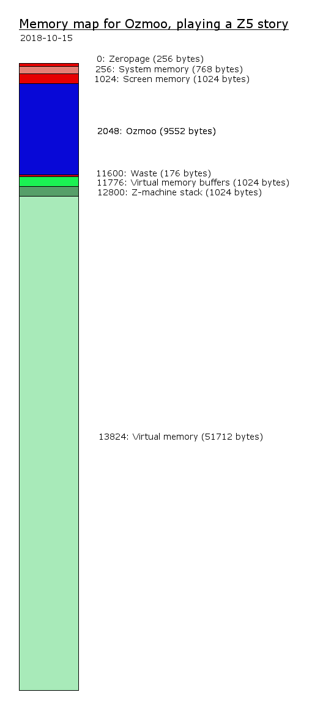
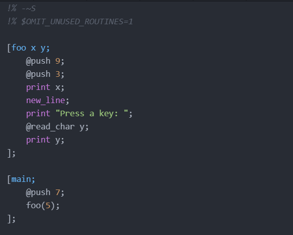
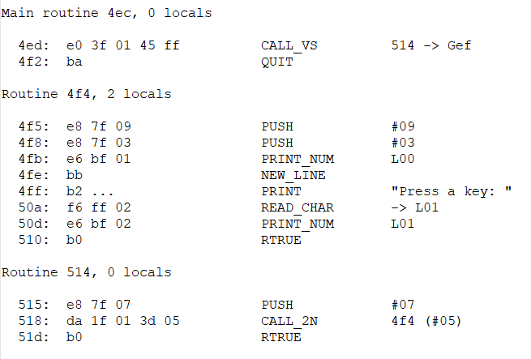
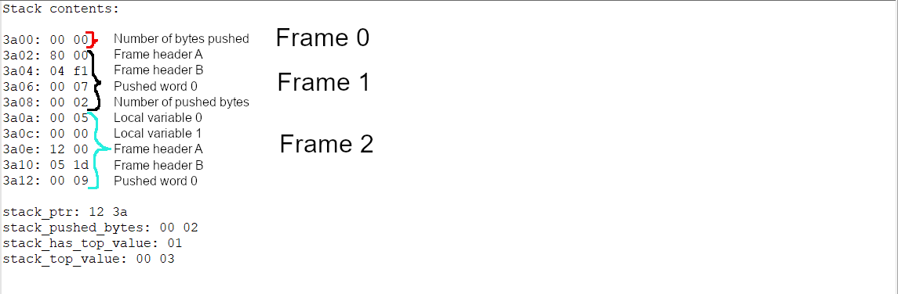
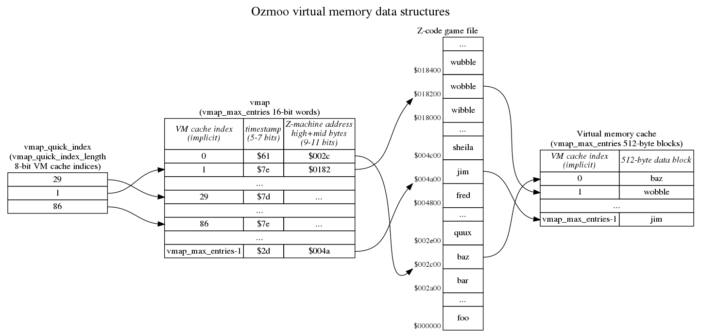

<!-- pandoc manual.md -o manual.pdf -->

# Program and Data Structures

## Overview

The main parts of Ozmoo are as follows:

- The interpreter
This is the main program that sets up the memory structures, reads the config into memory, and then starts executing the program instruction by instruction in the Z-machine emulator, taking care to read portions of the Z-code file from disk as needed.

- Virtual memory buffers
On some computers it is hard to use all the available RAM without time-consuming banking operations. To improve efficiency the virtual memory buffers are used when Ozmoo is compiled with virtual memory support, and located in RAM that is guaranteed to be accessible. By having the buffers in accessible RAM most operations can be done with direct RAM access, and banking is only needed when the program counter leaves the buffer. This system is used on C64 and C128.

- Z-machine stack
This is used to store arguments and function calls. The stack is described in detail in a chapter of its own.

- Virtual memory
The rest of the available RAM is divided into 512-byte blocks and used to store parts of the story file as needed by the game state. The virtual memory is a complex topic which is covered in more detail in a chapter of its own.

The next figure shows how memory may be allocated when playing a game on the Commodore 64.



## Source files

These source files are located in the asm dictory. The table also shows the most importand routines included in each source file.

| **File/Routine** |  **Comment** |
| -- |  ---- |
| ozmoo.asm | Ozmoo's main routine |
| &nbsp;&nbsp;&nbsp;_program_start_ | where execution of Ozmoo begins | 
|  |  |
| zmachine.asm | implements the Z-machine |
| &nbsp;&nbsp;&nbsp;_z\_execute_ | execute the Z-machine program | 
|  |  |
| c65toc64wrapper.asm | code to go to C64 mode on the MEGA65 |
|  |  |
| constants.asm | zero page allocations and kernal labels |
|  |  |
| constants-c128.asm | C128 zero page allocations and kernal labels |
|  |  |
| constants-header.asm | labels to access the header part of a story file |
|  |  |
| dictionary.asm | routines to access the dictionary of a story file |
|  |  |
| disk.asm | read and write to floppy disk |
| &nbsp;&nbsp;&nbsp;_readblock_ | read a memory block from the story file |
| &nbsp;&nbsp;&nbsp;_readblocks_ | read a memory block from the story file  |
| &nbsp;&nbsp;&nbsp;_read\_track\_sector_ | read single sector from the floppy disk |
|  |  |
| file-name.asm  (in temp folder)| holds the name of the boot file (file is generated by make.rb) |
|  |  |
| file-name.tpl | template used by make.rb to generate file-name.asm|
|  |  |
| memory.asm | routines to access the Z-machine memory |
|  |  |
| objecttable.asm | routines to access the object tree defined in a story file |
|  |  |
| picloader.asm | code to show a picture while reading the story file |
|  |  |
| pictures-mega65.asm | the version 6 picture engine for the MEGA65: the Full Colour Mode tile store, and decrunching the pictures' Exomizer archive into Attic RAM at boot |
|  |  |
| pictures-x16.asm | the version 6 picture engine for the X16: VERA's tile layer, and loading a picture from SD when it is drawn |
|  |  |
| reu.asm | implements the Ram Expansion Unit interface for C64 and C128, banked RAM for the X16, and an interface to Attic RAM on MEGA65 |
|  |  |
| screen.asm | printing routines |
|  |  |
| screen-z6.asm | printing routines for version 6, with its window model and graphics |
|  |  |
| screenkernal.asm | low-level display routines |
|  |  |
| screenkernal-z6.asm | low-level display routines for version 6 |
|  |  |
| sound.asm | routines to support playing sound effects|
|  |  |
| sound-aiff.asm | routines to support sound effects in AIFF format|
|  |  |
| sound-wav.asm | routines to support sound effects in WAV format|
|  |  |
| splashlines.asm (in temp folder)| contains splash screen text  (file is generated by make.rb) |
|  |  |
| splashlines.tpl | template used by make.rb to generate splashlines.asm |
|  |  |
| splashscreen.asm | show the splash screen |
|  |  |
| stack.asm | implements the Z-machine stack |
|  |  |
| streams.asm | implements text streams for the Z-machine |
|  |  |
| text.asm | routines to read and write text |
|  |  |
| utilities.asm | various utilities, error handling and debug routines |
|  |  |
| vdc.asm | low level routines to write text on the C128 in 80 column mode |
|  |  |
| vera.asm | defines the interface to the VERA chip for text and graphics output on the X16 |
|  |  |
| vmem.asm | virtual memory routines, and corresponding routines for non-vmem builds |
|  |  |
| walkthrough.asm (in temp folder)| contains walkthrough commands for benchmarking (file is generated by make.rb) |
|  |  |
| walkthrough.tpl | template used by make.rb to generate walkthrough.asm |
|  |  |
| zaddress.asm | routines to access data (i.e. not program code) in the Z-machine memory space |
|  |  |

## Startup

Ozmoo programs are compressed with Exomizer into a file called `story`, which is loaded and run like a Basic program. This file is sometimes referred to as a boot file. When this program is executed, the uncompressed Ozmoo program replaces `story` and execution starts from the program_start label.

First the screen is initialised and the splash screen displayed (if any). Then the config blocks (the first two blocks on the boot disk) are read, Ozmoo checks for an REU, the interpreter may ask the player to insert the story disk(s) into the drive(s), Ozmoo may read all of the story file into the REU, or it may load parts of it into RAM (if there is still some empty RAM after uncompressing the boot file). Then the Z-machine program counter is set to the start of the story, as specified in the header, and execution of the Z-machine program begins.

## Z-machine

The Z-machine executes instructions, using the Z-machine stack to keep track of calls and arguments. A Z-code file (AKA game file or story file, like zork1.dat or planetfall.z3) is essentially a snapshot of the memory of a virtual computer (the Z-machine). A Z-code file is divided into dynamic memory (up to 64 KB) and static memory (everything above dynamic memory, up to 512 KB). Dynamic memory is the only part that can be altered during program execution. Ozmoo keeps the entire contents of dynamic memory in RAM at all times, while using whatever RAM is left for virtual memory, to hold as much of static memory as possible. Whenever the player moves into a new location or tries something new and the disk starts spinning, this is because the program needs a part of static memory that isn't in RAM, so it has to be fetched from disk. What's so nice about this system is that it's handled entirely by the interpreter. The author of a game doesn't have to figure out when to load which parts of the story file - they can just write their game as if it's going to run on a computer with 128 or 256 KB of RAM, and the interpreter makes it work on a computer with much less RAM than that.

To further conserve space, the Z-machine has a text compression scheme built in. Basically it means each character is translated into one or more five-bit codes. By default, the space character and all lowercase letters fit into a single five-bit code each, while uppercase letters and special characters require two or four five-bit codes. These five bit codes are then grouped together so three of them occupy two bytes. I.e. "adventure" is stored as "adv" in two bytes, "ent" in two bytes and "ure" in two bytes, thus using six bytes. On top of this, there is a system of abbreviations, so common strings can be replaced by two five-bit codes.

## Disk I/O

Ozmoo is designed to use a floppy disk layout similar to what Infocom used, but it has some extra options such as using multiple disk drives to play bigger games. Config information for the game is stored in sector 0 and 1 of track 1 on the boot disk. The static memory portion of the story file is stored in the track 1 and up on the story disk(s). The boot file, containing the interpreter, dynamic memory and as much of static memory as possible, is stored on the boot disk or  in the remaining free space of the combined boot / story disk.

The disk I/O routines are located in disk.asm.  The virtual memory uses read_block and read_blocks to read data from the story file when needed. There is a routine read_track_sector for reading a single sector of the story file specified by track number and sector number.

## REU

If Ozmoo detects a RAM Expansion Unit (REU), and it's big enough to hold the entire story file, the player gets the question if they want to use it. If they do, the static part of the story file is read into the REU before the game starts. When the virtual memory system needs to read data from the story file by calling read_block or read_blocks (disk.asm) it will read the blocks from the REU instead of the floppy drive.

The interpreter detects the size of the REU in banks, where a bank is 64 KB. After deciding whether to use the REU for caching the story file, it may also allocate a bank for undo and a bank for scrollback buffer, if there is room and the game was built with support for these features. If the story file is stored in REU, it always begins in bank 0 and may use up to 8 banks. If story data is stored in the REU, the first page of bank 0 is reserved for fast page copying operations. If story data is not stored in the REU, and the REU is 256 KB or bigger, the first page of bank 3 is used for fast page copying operations instead. If the REU is smaller, fast page copying isn't used.

## X16 builds

On the X16, the main game file doesn't hold any story data. The entire Z-code file is held in a file called "zcode" and is loaded into banked RAM on boot. Since the entire file is held in one linear chunk of memory, and accessed in place (using banking), this is not a virtual memory build, and the VMEM constant is not defined. No config information is needed, so there are no config blocks on disk. This means a X16 game can be copied from one disk to another using a regular file copier.

A version 6 game built with Z6_PICTURES also has one file per picture, named
\[P001\] up to \[P999\], sitting in the game's directory beside \[ZCODE\]. Unlike
the MEGA65's, they are not compressed and are not preloaded: a picture is read
from the SD card the first time the game draws it. See "Version 6".

### X16 Memory map

Similar to C128, the graphics output is handled by a chip called VERA that contains the video memory. This means that no normal memory is needed for screen RAM. There is a standard 512 KB extended memory, of which a chunk/bank at a time is available at \$a000-\$bfff. The currently accessible bank of the extended memory is controlled by setting $0000 to the chunk number.

#### Normal memory

| **Address range** | **KB** |  **Usage** |
| -- |  - | ---- |
| \$0000-\$7eff | 32 | System RAM, interpreter, z-stack |
| \$7f00-\$9eff | 8 | Story file, low-RAM slice (from X16\_STORY\_BASE) |
| \$a000-\$bfff | 8 | Story file, banked chunk (bank 1 and up) |

The story's first pages live in normal RAM from X16\_STORY\_BASE (\$7f00); the
rest is reached through the banked window at \$a000. The interpreter and the
z-stack must end below X16\_STORY\_BASE, and three sites map a z-page to a bank
with the same 8 KB-aligned arithmetic (X16\_LOW\_STORY\_PAGES + (bank - 1) \* 32),
so the constant is required to be a multiple of 32 pages. The slice was 16 KB at
\$5f00 until the picture builds needed the room; dropping it to 8 KB freed 8 KB
of interpreter space at the cost of one more story bank of the 512 KB.

#### Video memory (VERA)

The standard text mode needs 80 x 60 x 2 = 9600 bytes, starting from \$1b000, since the screen is 80 columns, 60 rows, and each character is stored as a (character code, colour) tuple.

| **Address range** | **KB** |  **Usage** |
| -- |  - | ---- |
| \$1b000-\$1d580 | about 10 | Screen RAM |

A version 6 build with Z6_PICTURES puts the pictures on a second VERA layer
behind the text, and then most of the 128 KB of video RAM is in use:

| **Address range** | **KB** |  **Usage** |
| -- |  - | ---- |
| \$00000-\$0ffff | 64 | Picture tile store: 1024 tiles of 64 bytes (Z6_PICTURES) |
| \$10000-\$10fff | 4 | Layer 0 tile map, 64 x 32 entries of two bytes (Z6_PICTURES) |
| \$11000-\$117ff | 2 | The character set, moved out of the tile store's way (Z6_PICTURES) |
| \$13000-\$13fff | 4 | Sprite 0's image: the kernal's mouse pointer (Z6_MOUSE) |
| \$1b000-\$1c380 | 4 | Screen RAM (80 x 25 in a pictures build) |
| \$1fa00-\$1fbff | 0.5 | Palette RAM: 256 entries of two bytes |
| \$1fc00-\$1ffff | 1 | Sprite attributes |

Note that in an ordinary build the character set is left where the kernal keeps
it, in the first 64 KB, which is exactly where the tile store has to go — hence
the copy to \$11000 and the repointing of layer 1's tile base. Ozmoo also stops
using video RAM for the undo buffer in a pictures build, for the same reason;
see "Undo".

#### Extended/banked memory

| **Address range** | **KB** |  **Usage** |
| -- |  - | ---- |
| \$00000-\$02000 | 8 | Reserved space |
| \$02000-\$7ffff | 504 | Story file |

The extended memory is mapped into \$a000-\$bfff, so the memory is accessible in 8KB chunks. Note that the first 8KB is used by the kernal and DOS routines, so we load the story file from \$02000.

In a version 6 build with Z6_PICTURES, two more regions are carved out of the
banked memory above the story. The picture being drawn is read into a staging
area of four banks (32 KB, which is more than the largest picture file in any of
the four version 6 games), and if undo is enabled its buffer follows above that.
Both start from the first bank the story does not use, which make.rb computes
from the story's size and passes in as PIC\_STAGING\_BANK; it refuses the build
if the three together would not fit in the 512 KB. With the largest of the four
games, Shogun's 345 KB, the story ends in bank 41 and there is room to spare.

## MEGA65 builds

On the MEGA65, the boot file doesn't hold any story data. The entire Z-code file is held in a SEQ file called "zcode" and is loaded into Attic RAM on boot. Since the entire file is held in one linear chunk of memory, and accessed in place, this is not a virtual memory build, and the VMEM constant is not defined. No config information is needed, so there are no config blocks on disk. This means a MEGA65 game can be copied from one disk to another using a regular file copier.

A version 6 game built with Z6_PICTURES also carries its pictures, as one Exomizer archive per picture disk, decrunched into Attic RAM at boot. The archive is small enough to sit on the boot disk beside the story for every game shipped so far, which makes a MEGA65 version 6 game a single d81; a set too large for that falls back to picture disks of its own. See "Version 6".

### MEGA65 Memory map
| **Address range** | **KB** |  **Usage** |
| -- |  - | ---- |
| \$0000-\$ffff | 64 | System RAM, screen RAM, interpreter |
| \$10000-\$1ffff | 64 | Picture tile store (version 6, Z6_FCM_MODE without pictures); current sound effect (Z6_PICTURES) |
| \$40000-\$40fff | 4 | Screen RAM for scrollback mode |
| \$40000-\$4ffff | 64 | Current sound effect; picture tile store (Z6_PICTURES) |
| \$50000-\$5ffff | 64 | Undo buffer; picture tile store (Z6_PICTURES) |
| \$08000000-\$0807ffff | 512| Story file |
| \$08080000-\$080800ff | 0.25 | Signature of last game that was loaded (to make restart faster) |
| \$08100000-\$081fffff | 1024 | Sound data |
| \$08200000-\$082fffff | 1024 | Scrollback buffer |
| \$08300000-\$083000ff | 0.25 | Picture restart signature (version 6, Z6_PICTURES) |
| \$08300100- | | Pictures, decrunched (version 6, Z6_PICTURES) |
| \$08510000- | | One disk's crunched archive, staged while it is decrunched (Z6_PICTURES) |
| \$08600000- | | Undo buffer (Z6_PICTURES) |
| \$0ff80000-\$0ff807ff | 2 | Colour RAM |
| \$0ff80800-\$0ff817ff | 4 | Colour RAM for scrollback mode|

Bank 1, \$10000-\$1ffff, is untouched in an ordinary build: nothing in Ozmoo
addresses it, and the C64 mode kernal leaves it alone. A version 6 build in Full
Colour Mode uses it as the tile store, which holds 1024 tiles of 64 bytes.

That is enough for a full 40x25 screen in which no two cells are alike (the
80-column screen's 2000 cells would already outgrow it), but not
for a game that keeps several pictures on the screen at once. Arthur draws its
interface as pictures — a border, a scene and a status panel are all live
together, over a thousand tiles — so a build with Z6_PICTURES moves the store to
\$40000-\$5ffff, giving 2048 tiles, and moves the two things that lived there out
of the way. The current sound effect goes down into bank 1, which the tile store
has vacated; it has to stay in fast RAM because the audio DMA's stop address is
only 16 bits wide, so a sample must sit at the foot of a bank. The undo buffer
goes to Attic RAM at \$08600000, well clear of the decrunched pictures, because
it is only ever reached by DMA and so can live anywhere. Banks 2 and 3,
\$20000-\$3ffff, are the ROM and can never be used for any of this: the C64 font
the Full Colour Mode text is drawn with is read from \$2d800.

A single picture still has at most 2000 unique tiles, since it covers at most the
1000 logical cells of the screen, each of which is two tiles on the 80-column
screen.

In Full Colour Mode a cell is two bytes in both screen RAM and colour RAM. On the
80-column full colour screen that is 4000 bytes each: the screen grows to
\$0800-\$179f, ending just under the program at \$1800, and the colour bytes
outgrow the 2 KB window at \$d800 altogether — which is why all colour access
under Z6_FCM_MODE goes through 32-bit pointers to colour RAM's real home at
\$ff80000 instead of colour2k/colour1k. The legacy 40-column screen (-fcm:40)
uses the same 2000 bytes as the 80x25 text screen.

Note that the scrollback buffer's screen RAM and the current sound effect both
begin at \$40000. Opening the scrollback while a sound is playing therefore
corrupts the first 4000 bytes of the sample. It repairs itself, because the next
@sound_effect copies the sample from Attic RAM again. Version 6 games never have
a scrollback buffer, so this does not collide with the tile store.

## Save and Restore

The story file is read piece by piece by mapping the program counter to the correct track and sector, and read it into memory. The main function doing this is readblocks located in disk.asm

disk.asm also contains save and restore functionality. The main functions are do_save and do_restore. The save files are normal files that contain some important internal variables such as the program counter, the Z-machine stack, and the dynmem part of the RAM.

# Undo

If extra memory is available then it can be used to support undo for games that probe for this functionality. This is currently supported for C64 and C128 with a RAM Expansion Unit (REU), and for the MEGA65. To enable undo support the make.rb script should be called with the -u switch. If undo is enabled and the header has the undo flag set, then Ozmoo checks for available memory. If not found, then the undo header flag is cleared, and an error message is shown.

When undo support is active then the current game state (the stack, dynamic memory and some variables) are copied into the undo buffer before a new command is read from the user. This is similar to the save command, but saves to memory instead of saving to a file. If the user gives the undo command, then the state (dynamic memory, stack etc.) is instead copied from the undo buffer, and the execution continues from the saved state, undoing the previous turn.

The main functions for undo are do_save_undo and do_restore_undo in disk.asm. As in Frotz, a hotkey (Ctrl-U) has been added to enable undo support for z3 games, even if official undo support is only available for z5 and upwards. The hotkey handling code is found in text.asm.

On the MEGA65 the undo state is moved by DMA, so the buffer can live anywhere. Its address is the pair of constants UNDO_BANK and UNDO_ADDRESS_TOP: bank 5 of fast RAM normally, and Attic RAM at \$08600000 in a version 6 build with pictures, where the tile store takes bank 5 over.

On the X16 the undo state normally goes into video RAM, which is otherwise
unused below the text screen. A version 6 build with pictures fills that RAM with
the tile store, so the buffer moves into banked RAM instead, just above the
picture staging area (PIC\_UNDO\_BANK). Since source and destination then share
the one \$a000 window, do_save_undo and do_restore_undo copy through a pair of
helpers that switch the RAM bank around every byte and hand the caller's bank
back.

# Screenkernal 

Screenkernal, implemented in screenkernal.asm, is a replacement for the
low-level screen output routines on the Commodore computers. It is needed
to abstract away low-level implementation details so that new targets
can be more easily added, and also to support custom text scrolling to
to efficiently enable status lines, especially big ones used in games such
as Border Zone and Nord and Bert. The number of lines to protect when
scrolling is stored in window_start_row

The main functions of screenkernal are s_printchar, which replaced CHROUT \$FFD2, and s_plot which replaced PLOT \$FFF0. It also provides s_set_textcolour, s_delete_cursor, s_erase_window s_erase_line, s_erase_line_from_cursor and s_init.

Screenkernal is started by calling s_init. Internally it keeps track of the cursor position so it can put a character on the screen when s_printchar is called. 

For the Commodore 64 version the characters are stored directly in the video memory, and the colour in the colour memory.  The Commodore 128 version detects if 40 or 80 columns mode is used while running the program. If 40 characters are used, then it works like the Commodore 64 version. But if 80 columns are used, then the C128's Video Display Controller chip (VDC) is used. Instead of writing directly into the video memory, character output, scrolling and other screen commands are sent by VDC registers. The file vdc.asm contains functions that make this communication easier.

The X16 is using a separate chip called VERA for text output, similar to VDC for the C128. The file vera.asm defines the interface to the VERA chip used for putting characters on the screen.

The Plus/4 and Commodore 128 in 80 column mode doesn't use the same palette as the Commodore 64. Mapping tables (plus4_vic_colours and vdc_vic_colours) are used to assign C64 colours to their closest equivalents on these platforms.

# Version 6

Version 6 of the Z-machine replaces the two windows of versions 3 to 5 with
eight, each with its own rectangle on the screen, its own cursor and its own
colours, and it expects the interpreter to draw pictures. Ozmoo implements the
window model on every target, and the pictures on the MEGA65 (in Full Colour
Mode) and on the X16 (on a VERA tile layer). The C64 and the Plus/4 will never
draw pictures.

Because so much of the screen layer changes, version 6 gets its own copies of the
two screen files: screen-z6.asm and screenkernal-z6.asm, sourced instead of
screen.asm and screenkernal.asm when the Z6 flag is set. They are meant to stay
close to the files they were forked from; when the originals change, it is better
to fork them again than to patch the copies by hand.

## The window model

The eight windows are held in the property arrays the standard describes
(window_y, window_x, window_y_size, window_x_size, and so on), laid out one
after another so that get_wind_prop and put_wind_prop can find a property with
`window_y + 8 * property + window`. Coordinates are stored 0-based; the opcodes
convert to and from the 1-based coordinates the Z-machine uses.

Property 13, the font size, is the only property that is a real 16-bit word:
the height in the high byte and the width in the low one. It cannot live in the
byte-per-window arrays with the others, so get_wind_prop answers it directly,
with 1 and 1, because the header tells the game that a character is one unit wide
and one unit high. A game may divide by it, so it must never be zero.

Printing, wrapping, scrolling, the cursor, the MORE prompt and erasing are all
per window: text wraps at the window's right margin, a window scrolls its own
rectangle, and the MORE prompt appears in the window's bottom right cell rather
than the screen's. Each window keeps its own cursor and its own line count.

Every target scrolls a window rather than the screen, and they all do it with the
same code: .calc_window_rect works out the window's rectangle, .sw_up_one and
.sw_down_one move its rows, and .sw_blank_row blanks the one scrolled into view.
Only the row copy is per machine. The C64, the Plus/4 and the MEGA65 have their
screen in the CPU's address space and copy it themselves; the X16's VERA and the
C128's VDC do not, and get a row copy of their own (.vera_copy_row and
.vdc_copy_row).

The VDC's is worth a word, because the chip has a blitter and it would be a
waste not to use it. With the copy bit of the vertical scroll register (24) set,
writing a byte count to VDC_COUNT (30) copies that many bytes from the copy
source address (registers 32 and 33) to the current address (18 and 19). A row
of a window is therefore one register write rather than eighty read-and-write
round trips through the data port; the characters at $0000 and their attributes
at $0800 are copied in turn. A count of 0 means 256 bytes rather than none, so a
window with no columns has to be turned away before the blitter is asked to copy
a quarter of the screen. This is the same blitter the old whole-screen scroll
used, driven a row at a time between two arbitrary rows instead of down the whole
display.

## Extended Color Mode on the C64

The C64 has one background colour, which is no use to a game that wants eight
windows in eight colours. Z6_ECM_MODE, selected with make.rb's -ecm switch, turns
on the VIC-II's Extended Color Mode: the top two bits of a screen code choose one
of four background registers, \$d021 to \$d024, so each window can have its own
background. The price is that only 64 characters remain, so screen codes are
masked to six bits, uppercase renders as lowercase, and reverse video is not
available. ECM is C64 only; make.rb rejects it on other targets.

## Full Colour Mode on the MEGA65

The MEGA65 does not need the ECM compromise. Z6_FCM_MODE, selected with -fcm,
puts the VIC-IV into Full Colour Mode with 16-bit character codes on an 80x25
screen over a 640x200 (H640) canvas. The version 6 games assume 80 columns —
Zork Zero's layout breaks and Journey is simply unplayable at 40 — while their
art is drawn to a 320-wide scale, so the text uses the ROM font's ordinary
8-pixel glyphs and the pictures are pixel-doubled as they are baked (see
Pictures), keeping their intended size. -fcm:40 (Z6_FCM_40) still builds the
old 320x200, 40x25 screen; it renders text identically to the C64, which makes
it the line-for-line regression companion, and its disks carry an _fcm40 suffix
so the widths never share artifacts.

The registers are set up in init_mega65, with the hot registers turned off so the
values stick. The important ones are \$d031, where H640 is set (cleared under
-fcm:40), V400 is cleared and, less obviously, ATTR must also be cleared, because
that is what selects 8-bit
colour; and \$d054, where CHR16 and FCLRHI are set while FCLRLO is left clear.
FCLRLO clear is the whole trick: screen codes below 256 are still ordinary 8-byte
glyphs fetched from CHARPTR, so all the text renders as before, while codes from
256 up are 64-byte full colour tiles. CHARPTR points at \$2d800, the C64 font in
the MEGA65's ROM, whose codes 128 to 255 are the reversed glyphs, so reverse video
keeps working. The font is the usual 4 KB in two halves, uppercase and graphics
first and mixed case second, exactly as on a C64; \$2d800 is the second half.
Pointing it at \$2d000 instead renders lowercase as capitals and capitals as
graphics, which is invisible in an all-lowercase test game and obvious the moment
a real one prints a sentence.

A cell is two bytes in both screen RAM and colour RAM, so a row of 80 cells is
160 bytes and the two buffers are 4000 bytes each. The screen still fits below
the program (\$0800-\$179f), but the colour bytes no longer fit the CPU's 2 KB
window at \$d800, so under Z6_FCM_MODE every colour access goes through a 32-bit
pointer into colour RAM at \$ff80000 (sta [zp],z) instead of the old
colour2k/colour1k banking. zp_colourline is four bytes for it, at \$e5 — not at
its old \$f3, because the kernal's keyboard scan rewrites \$f5/\$f6 with its
decode-table pointer on every IRQ and would clobber the pointer's high word;
\$d9-\$f2 is the kernal screen editor's line-link table, which Ozmoo's own screen
code replaces, so that region is interrupt-safe and also houses the two scroll
scratch pointers and the [More] cell's pointer.
Ozmoo writes the character into the even byte of a screen cell and the colour into
the odd byte of a colour cell. The other two bytes, the screen cell's high byte and
the colour cell's flags, must be zero and stay zero: init_mega65 clears them once.

The code that reaches every cell would otherwise have to change everywhere, so:

- zp_screencolumn still holds a column, and only the sites that index the screen
  double it. That leaves the window edges, the margins and every comparison alone.
- zp_colourline is biased by one, so the same doubled index writes both the
  character and the colour. A row offset's low byte is a multiple of 32, so the
  bias never carries.
- Every place that writes a character also writes zero to the cell's high byte,
  with the clear_cell_high_byte macro. Without it, a character printed over a
  picture would leave the cell pointing at a tile.

Note that most text does not pass through s_printchar at all: it goes through
print_line_from_buffer in screen-z6.asm, which writes the screen directly.

Because s_printchar only ever writes two-byte FCM cells, there is no separate
text mode to fall back to, so the splash screen renders in Full Colour Mode like
everything else. Its lines are centred for 40 columns and get the same +20
re-centring as the 80-column text build; only -fcm:40 skips it, where +20 would
push them off the right edge and wrap into garbage. On quit,
z_ins_quit clears CHR16 and FCLRHI again -- the C64 reset it then performs never
touches \$d054 -- and turns the mouse sprite off, so the machine returns to a
legible BASIC screen rather than a 16-bit-character full colour one.

## Per-window backgrounds and reverse video

A version 6 window has its own colour pair (property 11: the background in the
high nybble, the foreground in the low). set_colour keeps each window's pair in
window_colour, and get_wind_prop answers it, because the games read it back —
Arthur reads the pair and sets its exact swap to box a parser message the way it
boxes the status line.

How that pair reaches the screen depends on what the hardware can do:

- **The X16 has a real per-cell background.** VERA's colour byte carries the
  background in its high nybble, so under Z6_WINDOW_BG (set for the X16) each
  window simply renders its own background colour. x16_apply_window_colour
  points the live VERA colour (background high nybble, foreground low) at the
  current window's pair; it runs on set_colour and on every window switch, so a
  window always prints in its own colours. Because the colour travels with the
  cell, the background fills on erase and survives a scroll for free. This is the
  clean version of what ECM does with four registers, and it retires the
  reverse-video fake below on the X16.
- **Every other target fakes it with reversed glyphs.** The C64, the C128, the
  Plus/4 and the MEGA65's full colour screen have no per-cell background, so a
  *swapped* pair — one whose foreground equals the screen background, which is
  exactly what the games ask for — is drawn as reversed glyphs: the field takes
  the requested background colour and the text takes the screen background. The
  glyphs already fill and scroll a cell at a time, but the swap *state* is per
  window, not global: window_swap records each window's, and apply_window_swap
  restores it (with the field colour) on a window switch, so a reversed field no
  longer bleeds onto the next window or comes out the wrong way round after a
  scroll. It forces the colour only for a swapped window, whose field colour is
  an explicit choice; a non-swap window keeps the global (and darkmode) colour.
- ECM keeps its four-register scheme (above); the reversed-glyph fake and
  Z6_WINDOW_BG both stand down on that target.

## Font 3

Font 3 is the standard's character-graphics font (section 16), a set of
box-drawing glyphs. Ozmoo has no such charset, but the only version 6 use of it
is Journey's command-menu dividers — the four corners, horizontal and vertical
lines, and a solid block that marks the connected command. Journey decides font
3 is available from the interpreter number, not from set_font's result, so it
prints the glyph codes regardless; on a plain interpreter they used to come out
as stray punctuation and digits.

set_font now accepts font 3 and records it per window (window_font, property 12;
the shared z_font is only two bytes, but a version 6 window runs 0 to 7). When
the current window is in font 3, font3_translate maps each glyph code to the
equivalent PETSCII box-drawing character before it enters the print buffer, so
the ordinary convert_petscii_to_screencode path renders it natively on every
text target — the C64, the C128's two screens, the Plus/4, the MEGA65 full
colour text screen and the X16 — with no per-target code. Codes the games do not
use pass through unchanged.

## The VERA screen on the X16

The X16's screen is not in the CPU's address space at all: VERA holds it, and it
is reached through a pair of address-and-data port pairs. A text cell is two
bytes, a character code and a colour, and a text row is 256 bytes whatever the
screen's width, so a cell lives at \$1b000 + row \* 256 + column \* 2. That is
convenient: the row is the address's high byte and the column can never carry
into it, which is why the screen code can keep a row in zp_screenline + 1 and
nothing else. Port 0 reads and port 1 writes; the rest of the screen layer
assumes port 0 is left selected with stride 1 (\$11 in VERA_addr_bank), so any
routine that borrows port 1 must hand port 0 back that way.

The ordinary version 6 build is text only, on VERA's 80x60 screen, and it needed
no window code of its own: .s_scroll_vera and the scroll_window opcode go through
the same .calc_window_rect / .sw_up_one / .sw_blank_row helpers as every other
target, and only the row copy (.vera_copy_row) is VERA's. One habit does not
survive the window model, though. print_line_from_buffer used to print its first
character through s_printchar and let the rest of the line ride on the address
pointer that call left behind, because VERA auto-increments. Now that a window
can scroll, s_printchar can end up inside .s_scroll_vera, whose copy loop leaves
the pointer wherever it happened to finish — so every cell is addressed on its
own, as on the other targets. Do not lean on VERA's auto-increment across a jsr.

### The pictures screen

VERA is a tile machine, so the X16 draws pictures the way the MEGA65 does, and
pictures-x16.asm is a port of the same engine (Z6_PICTURES; there is no -fcm to
ask for, since VERA has no equivalent switch). The difference is that VERA has
two layers, and Ozmoo uses both: the text stays on layer 1, exactly as in the
text-only build, and the pictures live on layer 0 behind it. A tile is 16 pixels
wide, 8 high and 4 bits a pixel, and layer 0's map is 64x32 of them.

The geometry is chosen to match the MEGA65's 80-column full colour screen, so
that dfrotz at 80x25 and the MEGA65 build remain the references for both. VERA's
scaling registers apply to the whole display rather than to one layer, so
halving VSCALE (to 64) and cropping the display with VSTOP turns the 80x60 text
mode into 80x25 of double-height rows on a 640x200 effective canvas.
SCREEN_HEIGHT is therefore 25 under Z6_PICTURES, and the build reports
interpreter number 6 (IBM), like the MEGA65's 80-column picture builds.

One picture tile is one logical 8x8 cell of the game's 320-wide art, with every
pixel written twice as the tile is baked, so a picture keeps its intended size
next to 8-pixel-wide text — the same doubling the MEGA65 does, but a whole cell
at a time, because a VERA tile is 16 pixels wide where a full colour cell is 8.
The tile store is the whole of VRAM's first 64 KB: 1024 tiles, with tile 0
reserved as the all-transparent tile an empty map cell shows, so a picture's run
of tiles starts at 1. That is half the MEGA65's 2048, and it is enough: the worst
live set any of the four games needs is about a thousand tiles (Arthur's frame
plus a scene plus its status panel; the largest single picture, the sword title,
is 751).

The colour arrangement is where VERA and the VIC-IV really part company. A layer
0 map entry is the tile's index (10 bits) and a palette offset (4 bits, plus the
flip bits, which Ozmoo does not use), and the offset selects one of 16 banks of
16 colours in VERA's palette RAM. So a picture's palette bank rides in the map
cells rather than in the pixels: the tiles hold the picture's own colour indices
untouched (0 transparent, 1 to 15 straight into the bank), and nothing has to be
rebaked when a bank is reassigned. Bank 0 is the text colours; a drawn picture
takes one of banks 1 to 14, bumped alongside its tile run and reused alongside
it, exactly as on the MEGA65.

Because the text sits on the layer in *front* of the pictures, drawing a picture
has to blank the text cells it covers, or a window's painted background would
hide the picture completely. It writes a space with the background nybble
cleared, which VERA renders as transparent, so the picture behind shows through;
erase_picture and erase_window put opaque background back and clear the layer 0
cells underneath. The result is the MEGA65's semantics — a picture replaces the
text in the cells it covers — reached by different means. A fully transparent
cell (\$ffff in the cell map) is left alone on both layers, so a frame with a
hole still shows the scene behind it.

Compositing a partly transparent cell over another picture works as it does on
the MEGA65, with one wrinkle. There, the store holds absolute palette indices and
every bank is loaded at once, so a composite tile can freely mix two pictures'
colours. Here a map entry carries a single palette offset, so a composite cell
can only speak one bank's language: the pixels kept from the picture behind are
translated into the overlay's bank, by exact colour match where the bank has the
same colour and by nearest colour (the smallest sum of absolute red, green and
blue differences) where it does not. The interpreter keeps a copy of every loaded
bank in ordinary RAM for that comparison, so it never has to read the palette back
out of VERA.

On quit the composer is put back — VSCALE, VSTOP, and layer 0 switched off —
because the X16 build returns to BASIC rather than resetting the machine, and
BASIC would otherwise come up on 25 double-height rows over whatever picture was
last drawn.

Layer 0 moves with the text. .s_scroll_vera calls pic_scroll_win_up after it
scrolls a window, so a drop-cap initial travels up with its paragraph instead of
staying put and smearing its colours across the scrolled text; erase_line clears
the layer 0 cells on the cursor's row (pic_erase_line_cells) as erase_window and
erase_picture already did, so a picture behind erased text goes with it. Both
touch whole map cells only and only VERA's write port, so the screen layer's
port 0 is left as it found it.

A picture cell is two text columns wide, and a game may place a picture at an
odd text column — Arthur centres its scenes. VERA's tile map is a 10-bit index,
so the MEGA65's trick of storing each half-cell as its own 8-pixel tile would
need more than the 1024 tiles the map can address. Instead an odd placement is
drawn with **boundary tiles**: .pic_fill_cells_odd spans one more map cell than
the picture is wide, and bakes each as the right half of one art cell beside the
left half of the next (.pic_bake_boundary_buf), from the picture's own stored
tiles. A picture whose copied run plus its boundary tiles would overflow the
store falls back to even placement — an eight-pixel shift, invisible on a
full-screen frame. Erasing an odd picture clears only the interior cells and
leaves the two shared edge cells, each of which holds half the picture beside
half of whatever it was composited over (a frame border), so the border survives
a room change and the next scene re-composites its half over it.

One more thing separates the two layers. On the MEGA65 a picture and the text
share one plane, so a transparent picture pixel shows the screen background
(\$d021) directly. On the X16 the picture is on layer 0 and its transparent
pixels (index 0) reveal VERA's backdrop — palette entry 0, which is black and is
shared with text colour 0, so it cannot simply be recoloured. Left alone, Zork
Zero's in-text insets (drop-cap initials, the banquet-hall statue, room icons)
sit in a black box inside the white text window, where the MEGA65 and sfrotz show
them on white. So a picture drawn over nothing has its transparent pixels filled
with the screen background instead: x16_screen_bg follows the last set_colour
background the way \$d021 would (set_window leaves it be, because a game draws an
inset into a throwaway window whose own background is the default while the text
around it is white). .pic_compute_bg_index finds that colour in the picture's
palette bank; the insets have no white, so it usually is not there, and the
colour is then injected into a free index the picture's pixels do not use
(pic_used, recorded while the tiles are copied) and the transparent pixels point
at it. Only a direct picture's own bank is written to; an adaptive picture shares
the direct one's bank and is left alone. Composited cells, a black screen
background and fully-opaque pictures are all unchanged.

## Pictures

Pictures are drawn on the MEGA65, with Z6_FCM_MODE, and on the X16 (see above).
On the C64 and the Plus/4, draw_picture writes a "pic:N" note where the picture
belongs, straight to the screen so that it never reaches the transcript,
erase_picture paints the note out, and picture_data reports that no picture
exists.

Everything in this section is the MEGA65's arrangement unless it says otherwise;
the X16 shares the design — the picture format, the index, the tile store, the
allocator, the compaction and the adaptive palettes — and differs in the hardware
it draws with and in how the pictures reach memory (the MEGA65 decrunches an
archive of them into Attic RAM at boot, the X16 reads one uncompressed file from
SD as each is drawn), both described in "The VERA screen on the X16" above and
summarised at the end of this section.

The pictures come from the game's blorb, converted by tools/pics2asm.py. Each
PNG becomes a fixed-format picture (numbered up to 999; the format is described
below), and the pictures of a disk are page-padded — so every one starts on an
Attic page boundary — concatenated, and crunched into a single Exomizer archive,
pics&lt;N&gt;.bin. make.rb's -pics switch takes a blorb file (or, for the test
pictures, a directory of numbered PNGs), runs the script, and sets Z6_PICTURES.
Only an index is assembled into the interpreter — the picture numbers, the Rect
placeholder sizes, the adaptive-palette flags, each picture's size in Attic pages
(pic_pages) and which disk its archive is on — so a set of a hundred and forty
pictures costs it almost nothing.

One archive per disk compresses far better than the old scheme of one RLE file
per picture, because Exomizer sees the redundancy *between* pictures — shared
palettes, repeated tiles and cell-map runs — that a per-picture coder cannot.
The whole set typically halves, and Zork Zero's 396 tiny icons shrink more than
threefold. Zork Zero and Journey had needed two picture disks each (Zork Zero
because 396 files overflowed a d81's directory, Journey because its bytes
overflowed one disk); afterwards every shipped game came down to one archive —
and every archive turned out to be small enough that the game needs no picture
disk at all.

The archive fits on the boot disk beside the story, the interpreter and the
sound, so that is where it goes: a MEGA65 version 6 game is a single d81.
make.rb's add_pictures_to_boot_disk writes it there with c1541 whenever a build
produced exactly one archive and it fits in what the finished disk reports free
— read back from the BAM with c1541 -dir rather than tallied, since the story,
the loader and the interpreter are written by three separate pieces of code —
and it deletes any picture disk left over from an earlier build of the same
game, so a stale one cannot be mistaken for current. The margins as shipped are
Arthur's 1213 blocks into 2039 free, Shogun's 862 into 1742, Zork Zero's 687
into 1917, and Journey's 1975 into 1987: twelve blocks to spare. (One trap in
that last step: c1541 converts a file name from ASCII to PETSCII, so it must be
given the name in *lower* case. "pics1" is stored as \$50 \$49 \$43 \$53 \$31,
the unshifted letters the interpreter's `!text "PICS1"` assembles to, while
"PICS1" is stored shifted, \$d0 \$c9 \$c3 \$d3 \$31, and is never found.)

A set that needs more than one archive, or one that no longer fits beside its
story, still falls back to build_picture_disks: pics2asm.py packs the pictures
across as many mega65_&lt;game&gt;_pics_N.d81 disks as their archives need,
capped by block count, and make.rb builds one d81 each, one archive on it.
(Because a disk now holds one archive rather than one file per picture, the d81
directory limit that used to split Zork Zero no longer bites.)

The interpreter is not told which arrangement it got. At boot, pic_load_all
sweeps the picture disks in turn: for each it finds the archive, reads it into
an Attic staging buffer at \$08510000, then decrunches it forward onto the
running Attic write pointer, under a "loading graphics" label with a slash
progress bar. The bar ticks once every so many pages *staged from disk* — the
slow part on a real 1581 — scaled through the assembled-in
picture_crunched_pages so it is about thirty slashes wide whatever the set's
size. To find a disk, pic_load_all probes the boot drive first and then the
second drive (boot_device + 1), reading the drive error channel to tell a
present file from a missing one — a missing file OPENs "successfully" but reads
back a stale buffer page, so the status byte lies — and only asks for a swap if
neither drive holds it. The boot drive comes first because that is where the
archive normally is now; a drive that is not there answers a probe with a KERNAL
timeout rather than a quick "file not found", and a picture disk from another
Ozmoo game left in the second drive would carry a PICS&lt;N&gt; of its own.
make.rb still mounts the first picture disk in drive 9 when a build really
produced one. The picture count and the picture numbers are both 16-bit:
.pic_index is a word and the parallel pic_* tables are indexed through
.pic_addr.

The decruncher is a port of Exomizer's reference decoder (exodec.c) for the -P0
stream format, so pics2asm.py crunches with `exomizer raw -C -P0 -c -m 4096` to
match. It reads the archive *forward* from the staging buffer through the 45GS02's
[zp],z addressing and writes the plaintext forward into the picture area; a
back-reference is read straight out of the plaintext already written (src = output
- offset), so there is no ring buffer to maintain. `-m 4096` bounds a match to
4 KB back, which costs almost nothing here — page-padded, tile-deduplicated
pictures match locally — and keeps the offset arithmetic to two bytes. The
plaintext it produces is the padded concatenation the archive was built from, so
each picture lands on exactly the page pic_pages predicts.

A restart does not pay the load twice. z_ins_restart reboots the machine and
reloads the interpreter from disk, so pic_load_all runs again on every "restart"
command and every death — but Attic RAM survives the reset, and the pictures are
still sitting in it. This time the page tables that say where each picture landed
need no rescue: pic_page_lo and pic_page_hi are computed at every boot by summing
the assembled-in pic_pages (each picture's size in pages, known at build time
because the *uncompressed* size is) up from PIC_ATTIC_PAGE, so they are correct
whether the pictures were just decrunched or have been sitting in Attic since a
previous boot. All that has to survive the reboot, then, is the answer to "are the
pictures still there?", and \$08300000 holds it: an eight-byte signature, with the
pictures starting one page above at PIC_ATTIC_PAGE. On boot a matching signature
skips the disks entirely, swaps and all. This is reu_filled's idiom from disk.asm,
a signature that outlives the reboot to say the data is already there, with two
differences: it cannot use game_id, which is inside !ifdef VMEM and so does not
exist on the MEGA65, and uses the story's serial and checksum instead — they
identify the story file just as well, and Ozmoo never rewrites either, unlike
flags\_2 or the screen dimensions; and the signature is written *last*, after the
pictures, so a load interrupted partway leaves none claiming they are good. The
check runs on every boot rather than only after a restart, so a cold reboot of the
same game skips the load as well. The X16 needs none of this, having no preload at
all.

A blorb holds more than PNGs. Its Rect resources are placeholders with no image,
only a width and height; a game reads those sizes with picture_data to lay real
pictures out, and Arthur's whole room frame is built that way, so pics2asm.py
emits a table of them (in cells, ceil(pixels/8)) that picture_data answers from
and draw_picture treats as invisible. Its APal chunk lists the adaptive-palette
pictures (see below). Reading the blorb directly rather than a hand-extracted PNG
directory is what makes both of these available.

A picture holds the cell dimensions, the number of unique tiles, a 48-byte
palette, a cell map of two bytes a cell, and then the tiles. Identical cells are
stored once. Each picture is padded up to a page boundary; the pictures of a disk
are concatenated in that padded form and the whole run is Exomizer-crunched into
the disk's archive, so the compression works across pictures, not just within one.
Once decrunched into Attic RAM the layout is exactly this padded concatenation, and
the padding is why each picture begins on a page whose number the index already
knows.

Two things about the pixels:

- A pixel is four bits, so two pixels share a byte on disk and in Attic RAM,
  while in the tile store a pixel is a whole byte. On the 80-column screen each
  logical 8x8 cell of the source becomes two screen cells — its left half and
  its right — and the halves are stored undoubled: a tile on disk is then 4
  source pixels a row, 16 bytes, and .pic_copy_tiles writes every pixel twice as
  it bakes the 64-byte store tile, doubling the picture to its 320-wide visual
  scale for free. (Under -fcm:40 a tile is the whole 8x8 cell, 32 bytes, written
  once.) Deduplication happens on the stored tiles either way. Storing four
  bits a pixel halves the picture set before it is compressed, and Arthur's does
  not otherwise fit on a d81.
- A colour index of 0 is transparent, and 255 is taken from colour RAM, so
  neither may be a real colour. A picture therefore has at most 15 colours. The
  indices are the PNG's own, not compacted: a pixel is its palette index
  straight, and the 48-byte palette is stored in that same index order. Keeping
  the indices is what lets an adaptive picture borrow another's palette (below).
  Arthur's pictures put transparency at index 0 and never colour index 0.

Drawing a picture reads its header and palette straight out of Attic RAM, gives
the window a run of the tile store, copies the tiles down into it, and fills the
window's cells. In Full Colour Mode a cell's screen code is its tile's address
divided by 64, so a code is FCM_TILE_CODE_HI's worth of high byte plus the tile's
index: the store's base is a multiple of \$4000 either way, so nothing carries.

A cell holds exactly one tile, so a picture drawn over another replaces those
cells outright. A cell that is transparent through and through is the exception:
pics2asm.py writes it into the cell map as \$ffff, and pic_fill_cells leaves such
a cell untouched, so a frame with a hole drawn over a scene shows the scene
through the hole. That is how Arthur composites — it draws the scene, then draws
the frame, whose middle is a transparent window onto the scene behind. A partly
transparent cell is still one opaque tile, and its transparent pixels show the
screen background rather than the picture behind. Drawing is clipped to the
screen: pic_fill_cells and pic_erase stop at the last row and column, so a picture
placed partly, or from a bad coordinate wholly, off screen cannot scribble past
screen RAM into the interpreter.

picture_data is what makes a picture land in the right place. It reports a
picture's height and width, which the game halves against the window's size to
centre it. The standard calls those two words pixels, but a pixel here is whatever
unit the rest of the screen model counts in, and Ozmoo counts characters: the
header advertises an 80x25 screen (40x25 under -fcm:40) and get_wind_prop answers
1x1 for the font size, so the size must come back in cells. On the 80-column
screen the blob header and the Rect tables already carry the doubled widths, so
the game lays everything out in the 80-wide grid without any conversion.

Each drawn picture gets its own run of the tile store and its own palette bank,
allocated together and reused together. The bank is `16 * bank`, bank running
1 to 14 (bank 15 is skipped, because its top colour would be pixel value 255,
which Full Colour Mode takes from colour RAM). A per-picture bank, rather than
the one-bank-per-window arrangement it replaced, is needed because a window holds
several pictures at once — Arthur's frame and two side bars all live in window 7
— and a shared bank had them overwrite each other's colours. A picture's pixels
are its palette indices straight, so the tile copy adds the bank's base to each
non-zero pixel as it goes, leaving a 0 alone because it is transparent. The DMA
engine can neither add nor expand a nybble, so that copy is done by the CPU; at
40 MHz even a full screen picture is a blink.

The bank travels with the tile run: the allocator reuses a window's run, and its
bank, only when the same picture is redrawn into it; a different picture takes a
fresh run and bank, bumped from where the last one ended. The store holds 2048
tiles in a Z6_PICTURES build, which is what Arthur's interface needs: it keeps a
border, a scene and a status panel on the screen together, and they came to 1063
tiles the first time all three were live. With the old store of 1024 the allocator
wrapped and the border's tiles landed on the scene's. On the 80-column screen the
same live set measures 1894 tiles — splitting every logical cell in two does not
double the unique count, because the halves deduplicate — and pics2asm.py's
--stats switch prints the per-picture numbers without writing anything.

Even 2048 tiles run out, though, because a game may draw one picture over
another and keep both: Arthur draws the Merlin scene centred inside the sword
picture, whose gold frame stays visible around it, and the two together are more
than the store holds. So when a fresh run will not fit, the allocator compacts
the store rather than wrapping over it (.pic_gc). It marks every tile that a cell
*outside* the incoming picture's rectangle still shows, moves those survivors down
to the bottom of the store in ascending order — a survivor can only move down, so
the copy is safe in place — and repoints the cells that show them; the new run
then lands above the survivors. Cells the new picture is about to cover are not
marked, since it is about to overwrite them anyway, and if their tiles are shared
with cells outside (Arthur's borders repeat), the sharing marks them survivors in
any case. The sweep works from a bitmap of live tiles, a per-byte prefix count of
the survivors below it and a popcount table. Only if the survivors plus the new
picture still do not fit does the old wrap-to-zero happen, which can then only
spoil a picture that is no longer the newest on screen. The palette allocator
still simply wraps, with the same consequence.

Not every tile a draw consumes comes out of that run, and the difference is worth
spelling out, because it cost a long hunt. The allocator reserves a picture's own
tiles and nothing more, but both draw paths then bake further tiles from
pic_next_tile as they go — a composite where a partly transparent cell falls over
an existing picture, and on the X16 a boundary tile per cell of an odd-column
placement. Those belong to no window's run, so the store can genuinely run out in
the middle of a draw, where there is no opportunity to compact: the picture's own
run is already placed and half its cells are written. The X16's baker therefore
*saturates* rather than wrapping (.pcf_alloc_and_write): pic_next_tile stops at
PIC_MAX_TILES and the bake reports failure, and the caller degrades for the cells
it could not bake — the even paths keep their own un-composited tile, the odd
path keeps whatever was behind. That is self-correcting, because a saturated
pic_next_tile fails the allocator's fit check, so the next picture drawn compacts
the store and the bakes have room again; the cost is cosmetic, confined to a
nearly full store, and the alternative was corruption.

It used to wrap to the bottom of the store, and that destroyed Arthur's frame a
few rooms into a game. Everything below is live — the picture's own run, and the
frame, which is drawn once at boot and never redrawn and so sits at the very
bottom — so the wrap landed squarely on it. Two properties made it hard to see.
The damage surfaced two rooms *after* the wrap, only once the allocator had
marched back up into the frame's tiles, which pointed suspicion at the wrong
event. And the wrap disabled the compactor that would have saved it: it left
pic_next_tile low, so the fit check always passed and .pic_gc never ran again.
The lesson generalises past this engine — an allocator that wraps onto live data
is a bug rather than a fallback, and a wrap that erases the "store is full"
signal takes the recovery path down with it. The MEGA65's baker still wraps: it
has 2048 tiles and half the X16's per-picture cost, so it has not bitten, but the
defect is the same one and the fix to port is the X16's.

Some pictures do not carry their own colours. The blorb's APal chunk lists the
"adaptive" pictures — Arthur's frame and side bars — which are drawn in the
palette of the last direct (non-adaptive) picture instead of their own. That is
how one UI element recolours to match whichever scene it borders; in the blorb the
frame's own palette is a placeholder of plain primaries. The interpreter remembers
the last direct picture's bank (pic_direct_base), and for an adaptive picture it
skips loading a palette and bakes the tiles into that bank. Because the indices are
never compacted, the frame's index 5 means the same colour as the scene's index 5,
and the borrowed palette lands right.

### What the X16 does differently

The X16 shares all of the above: the same converter, the same index, the same
allocator, compaction and adaptive palettes, and the same clipping. It differs in
four ways, three of them consequences of the hardware and one of the machine it
runs on.

- **The tiles and the cells.** A tile is a 16x8 VERA tile rather than a 64-byte
  full colour cell, so a logical art cell is one tile, not two, and pics2asm.py's
  --x16 mode writes one cell-map entry and one 32-byte tile per cell (the pixels
  undoubled; the interpreter doubles each as it bakes). The palette is 32 bytes in
  VERA's own format instead of 48 in the VIC-IV's. The store holds 1024 tiles,
  with tile 0 reserved as the transparent tile.
- **The palette bank is in the map entry, not in the pixels.** Which means a
  composite cell can carry only one bank, and the pixels taken from the picture
  behind have to be colour-matched into the overlay's — see "The VERA screen on
  the X16".
- **The pictures are loaded when they are drawn, not at boot.** There is nowhere
  on the X16 to preload half a megabyte of pictures: the story already fills most
  of the 512 KB of banked RAM. But the pictures are on an SD card, not a floppy,
  so there is no need to. Each picture is an ordinary uncompressed file in the
  game's directory, and the engine reads it into the staging banks the first time
  the game draws it, remembering which picture is staged so that redrawing the
  frame or a status icon never touches the card again. The files are therefore
  not compressed and there is no decruncher, no picture archive, no picture disk,
  and no disk swapping — Zork Zero's 396 pictures simply sit in the directory. The cost is
  that picture_data cannot read a size out of the staged picture, because it is
  usually asked about a picture that is not the staged one, so pics2asm.py
  assembles the sizes in as pic_width and pic_height tables (in text cells, as
  the MEGA65 reports them).
- **The text is a layer in front, so drawing must blank it**, and erasing must put
  it back. On the MEGA65 the text and the picture share one plane, and a tile
  simply replaces a character.

## Mouse

The mouse (z-spec 10.3) is drawn on the two screens that can show a pointer: the
MEGA65's full colour screen and the X16's pictures screen. Both are in
asm/mouse.asm, guarded by Z6_MOUSE, which is set for Z6_FCM_MODE or for the X16
with Z6_PICTURES; text-only version 6 has no pointer on either machine. A
game asks for a mouse by setting bit 5 of Flags 2, and the interpreter leaves
that bit set only where it can honour it. z_init reads the bit and, if the game
wants a mouse, calls mouse_enable, which shows the pointer and sets mouse_active;
a game that does not ask gets no pointer and its clicks are ignored. (Arthur,
Zork Zero and testz6 — whose read_mouse test asks — all get one.)

Everything the standard asks for is the same on both machines and is written
once: the press edge that turns a held button into a single click, the cell the
click landed in, the words written into the header extension table, and the
window the mouse is confined to. Only reading the hardware and moving the
pointer differ, and that is one routine, mouse_read, which mouse_poll calls and
which returns the button mask with the pointer's pixel position updated.

### The MEGA65's mouse

The pointer is the 1351 or Amiga mouse on control port 2. The MEGA65 exposes its
paddle lines directly at \$d620 and \$d621, with no SID or CIA multiplexing to
arrange, and the button is the port 2 fire line, \$dc00 bit 4. Port 2 is the
clean joystick port; port 1 shares its lines with the keyboard matrix, so its
fire bit \$dc01 bit 4 reads keyboard row 4 as well and cannot tell a click from
a SPACE. The paddle value is a six bit counter that wraps, so mouse_poll cannot
read an absolute position;
it remembers the previous reading, folds the difference into a signed step of
-32 to 31, and accumulates a pixel position clamped to the screen: 640x200, or
320x200 under -fcm:40. Sprite X coordinates stay in the 320-wide space under
H640 — one sprite unit covers two physical pixels — so mouse_place_sprite halves
the position on the 80-column screen and the pointer moves in two-pixel steps.

The pointer is sprite 0. Its bitmap is a small red arrow (red so it stays visible
over the white status line), and it is addressed through
the VIC-IV's 16-bit sprite pointer (\$d06c to \$d06e, with the SPRPTR16 bit set),
because the sprite pointer list normally sits at the top of screen RAM, which on
the full colour screen is picture and text data. There is no hardware that makes
a sprite follow the mouse; the MEGA65 KERNAL moves it in an interrupt and so does
Ozmoo, from mouse_poll. On quit the sprite is switched off along with the full
colour mode bits, so no arrow is left on the BASIC screen.

### The X16's mouse

On the X16 the kernal owns the mouse, and mouse_read is a single call into it.
mouse_config (\$ff68) shows the pointer and gives it its bounds, taken in units
of 8 pixels: 80 by 25, which is the 640x200 pictures screen. mouse_get (\$ff6b)
fills four zero page bytes with the position and returns the button mask in the
accumulator; the four bytes are the kernal's own API registers r0 and r1 at
\$02, which its interrupt handler saves and restores around its use of them, so
they are safe to borrow. The kernal's default interrupt handler also calls
mouse_scan and moves the pointer itself, and Ozmoo never replaces the interrupt
vector on the X16, so there is no sprite for Ozmoo to place and no paddle
counter to difference.

The pointer is VERA sprite 0, and the kernal keeps its image at video RAM
\$13000, which is clear of both the tile store and the layer 0 map (see the X16
memory map above). mouse_enable therefore only has to switch the sprite layer on
in DC_VIDEO. One detail is worth knowing: because the screen is fewer than 31
cells high, the kernal doubles its internal y coordinate and mouse_get halves it
back again. That is exactly right for a screen whose VSCALE is halved — the
pointer moves at the same physical speed as on any other X16 screen, and reports
a position of 0 to 199. On quit the pointer is hidden with mouse_config again,
which also puts the system management controller back to sending key codes only.

### Clicks, and how they reach the game

mouse_poll is called from getchar, the routine every input path waits on, so the
pointer follows the mouse through read, read_char and the [MORE] prompt, and a
button press is delivered as input character 254 the moment it happens. On a
click the cell the pointer is over is written into words 1 and 2 of the header
extension table, as the standard requires; read_mouse reports the same position
and the button, and mouse_window confines later clicks to one window. A click
ends a line only if 254 is a terminating character, which the game arranges
through the terminating characters table -- see below.

The terminating characters table (header \$2e, z-spec 10.5.2.1) is a list of the
function key codes that end an input line, in addition to Return. The valid codes
are 129 to 154 and 252 to 254, and the special value 255 means "any of them".
parse_terminating_characters had rejected everything above 140 and, for the 255
wildcard, activated only the ordinary function keys, never the mouse clicks 252
to 254 -- so a click could not end a line, whichever way a game asked. It now
accepts the whole valid range, and the default set it turns on for the wildcard
includes the mouse clicks on a screen that has a mouse, so both a game that lists
the clicks (Arthur) and one that says "any function key" (Zork Zero) work.


# The stack

The exact layout of the stack is an implementation detail, not part of the Z-machine specification. However, the Z-machine specification does say a few things about how the stack should _work_. Each routine call creates a stack frame. Instructions can push any number of values onto the stack, and pull values from the stack, or read or change the top value without pushing or pulling it. A value is always word-sized. Pushed values can only be accessed by instructions in the same routine ( = same stack frame). When a routine returns, all values which have been pushed inside that routine and are still on the stack are discarded. The stack resides outside the Z-machine, and there is no way for a Z-machine program to check if there are values on the stack, if there is room for more values, how many stack frames there are etc.

The stack in Ozmoo consists of a number of words. The default size is 512 words. With each procedure call that is made, a new stack frame is created. The first stack frame begins at the first address of the stack (label stack_start).

A stack frame consists of the following parts:

1. The current values of all local variables of the routine (0-15 words).

2. Frame header (2 words)

> Frame header A has the following parts:

>> Byte 0, bit 7: 1 = The return value of this procedure call should be written into a variable 

>> Byte 0, bit 4-6: In version 5+, the number of parameters this procedure was called with (0-7)

>> Byte 0: bit 0-3: The number of local variables this procedure has (0-15)

>> Byte 1, bit 7: 1 = this routine call was done due to an input interrupt

>> Byte 1, bit 0-2: Bit 16-18 of the return address

> Frame header B:

>> Bit 0-15 of the return address (highbyte first).
	 
3. Pushed words (0 or more words)

4. Number of pushed bytes (1 word)

The first frame lacks part 1 and 2. The current frame lacks part 4.

Apart from this, Ozmoo also has a few variables on zeropage to keep track of the stack:

stack_ptr (word): a pointer to where part 3 of the current stack frame begins

stack_pushed_bytes (word): A counter of how many words part 3 of the current frame consists of.

stack_has_top_value (byte): If the value is 1, the last value pushed onto the stack in the current frame hasn't been put on the actual stack, but resides in the variable stack_top_value instead.

stack_top_value (word): If stack_has_top_value is 1, this contains the top value on the stack.

The stack_top_value variable has been added for performance reasons.

Frame 0 isn't a full stack frame. When a Z-machine interpreter begins execution of a program, it just starts at the start address given in the header of the story file, with an empty stack. The start address can be in the middle of a routine. This means the interpreter doesn't know of any local variables, and there is no return address - it's not legal to perform a return from this routine. This "fake" routine is just a simple way to get started, and the only thing you want to do in this routine is call a "real" routine and then perform quit. Inform 6 adds such a routine automatically, and it calls the routine "main" which must be defined in the Inform 6 program and then quits. To make things more confusing, this little "fake" routine is called "main" when disassembling the Z-code program.

Let's go through an example program and what it does to the stack. We run it until it performs @read_char and then we pause and look at the stack. This is a version 5 program.







Inform's built-in "fake" main routine (on address \$4ec) calls our main routine (on address \$514). This causes Omzoo to close the current frame (Frame 0, which isn't a full stack frame) by moving the top value from stack_top_value (if any) to the stack, and writing the total number of pushed bytes as a word to the stack. In this case, there are no values on the stack, and no value in stack_top_value, so Ozmoo just copies the value in stack_pushed_bytes (0) to the stack. 

Ozmoo then starts a new stack frame - frame 1. The main routine at \$514 has 0 local variables, so it doesn't reserve any space for part 1. It then writes the frame header to the stack. Frame header A is \$80, \$00 because the procedure call is made using call_vs which expects the return value to be written into a variable, there are no arguments and the routine has no local variables, the routine was not called due to an interrupt, and bit 16-18 in the return address are all 0. Frame header B holds the value \$04f1, which points to the last byte of the call_vs statement, holding the variable number where the result is to be stored upon return.

Program execution now continues in our main routine at address \$515 (the routine's official start address is 514, but the first instruction is on address \$515.) The first instruction pushes the value 7 onto the stack. The second instructions performs a call_2n instruction to call the foo routine with one argument, which is the value 5. We can see that the value 7 has been pushed onto the stack, and that the counter says a total of 2 bytes have been pushed onto the stack in this frame.

Ozmoo now opens stack frame 2. The routine being called (the foo routine located at address \$4f4) has two local variables, so Ozmoo makes room for two words on the stack for part 1 of the frame. The first variable gets the value 5, since the procedure was called with this as an argument. Ozmoo then adds part 2, the header. Frame header A gets the value \$12, \$00 because the routine was not called with an instruction which expects the return value to be written into a variable, the routine call was made with 1 parameter, the routine has 2 local variables, the routine was not called due to an interrupt, and bit 16-18 of the return address are 0. Frame header B holds the value \$051d, which is where execution should resume upon return from this routine.

The foo routine pushes the value 9 and then the value 3. At the time when we inspect the stack, the value 3 is held in stack_top_value. If we were to push another value, or call a procedure, this value would be written to the stack as well.

There are two more print instructions and a new_line instruction before read_char, but none of them interfere with the stack. When we hit read_char, we paused the program and inspected the stack.

# Virtual Memory

This chapter is based on a document written by Steve Flintham.



## The basics

The virtual memory subsystem is only used for the game's static and high memory, which are read-only. The game's dynamic memory is always held entirely in RAM.

The virtual memory code does most of its work in the read_byte_at_z_address subroutine. (This can be seen in vmem.asm; there are multiple versions of this subroutine in the file because conditional assembly is used to allow non-VM builds, but the VM version starts about halfway down.) It's entered with a 24-bit Z-machine address in A, X and Y (high byte in A, middle byte in X, low byte in Y) and returns the value at this address in A. Also, upon returning, Y is 0 and mempointer (a 2-byte zero page pointer) is set so that "lda (mempointer),y" returns the byte at the 24-bit address given.

Note that read_byte_at_z_address isn't called for every single read from Z-machine high and static workspace; there are subroutines layered on top of it which only call it when necessary.

Virtual memory is handled in 512-byte blocks, which are always aligned at a 512-byte boundary in the game file and in memory. This means that every VM block has a Z-machine address of the form \$abcd00, and the least significant bit of d is always 0.

The VM system has a cache with vmap_max_entries 512-byte blocks of RAM to use to hold blocks read from disc. There's a parallel data structure called the vmap with vmap_max_entries 16-bit words in it to track what block of game data is in each cache block. At the most basic level, we can imagine that if block 4 of the cache contains the 512-byte block starting at \$018200 in the game file, vmap[4] contains \$0182.

If we want to access the byte at \$018278, we round that down to the previous 512-byte boundary to get \$018200 and then search through all the entries in vmap to see if any of them contain \$0182. In this case, entry 4 does, so we'll set mempointer to cache_start_address+4\*512+\$078, load the value at that address into A and return. Where does the \$078 come from? This is the low 9 bits of the address we were given, which can be thought of as an offset to the byte of interest within this 512-byte block.

What if none of the vmap entries contains \$0182? In that case we need to pick one to overwrite; let's say we pick entry 7. Because we only use virtual memory for read-only data, we can just read the 512-byte block at offset \$018200 in the game file into memory at
cache_start_address+7\*512  (overwriting whatever was there), set vmap[7] to \$0182 and return with A set to the value held in address cache_start_address+7\*512+\$078.

At the most basic level, that's all there is to it. But in practice there are some additional details we need to take care of.

## Timestamps

We need to be able to make a sensible decision about which cache block we're going to overwrite when we need to read a block of data in from disc because it's not in the cache. What we want to do is keep hold of cache blocks we've recently used, and instead discard a block we haven't used in a while, on the reasonable assumption that we're more likely to use a block in the near future if we've recently used it.

To implement this, each vmap entry also contains a timestamp. There's a global "current time", called vmem_tick, and every time we access a cached block its timestamp is set to vmem_tick. vmem_tick is incremented whenever we need to read data from disc because it's not in the cache. Note that several entries in the vmap can therefore share the same timestamp - if we access cache blocks 4, 8 and 22 without needing to read anything from disc, all of those will have the same timestamp (the current value of vmem_tick).

Also, there's a mechanism to keep vmem_ticks from getting too big for the space available. For a z3 game, we have 8 bits for storing tick values for each vmem block. We start with the value 0 and we can just increase it until we reach 255. When we hit 256, we change the tick counter to 128, and we reduce the tick value in all vmem blocks by 128. Since we're using unsigned numbers here, a block which had the tick value 27 now gets 0. A block which had tick value 150 now gets 22 etc. The next block we read from disk gets the tick value 128, the next after that gets 129 etc. Next time we reach 256, we just repeat the above procedure. 

With that infrastructure in place, when we need to overwrite a block in the cache with a new block from disc, we can pick a block with the oldest timestamp. (Not *the* block with the oldest timestamp, because as noted above several blocks can share the same timestamp.) There's one caveat, which is that if the Z-machine program counter is currently pointing into a cache block, it is exempt from being overwritten - it would obviously be a bad thing to overwrite the instructions currently being executed with some arbitrary data! I won't go into too much detail on this here, because it's probably best discussed in the context of the routines layered on top of read_byte_at_z_address.

The timestamps are packed into the high bits of the 16-bit entries in vmap, with the low bits representing the high and mid bytes of the Z-machine address. For Z3 games, where Z-machine addresses only have 17 bits (a maximum game size of 128K), only 9 bits of the vmap entry are needed for the high and mid bytes of the address and 7 bits are available for the timestamp. But note that the lowest bit of the address is always zero since the memory is divided into 512-byte blocks. Assuming this zero we can instead store the address in 8 bits and increase the time stamp resolution to 8 bits.

Larger versions of the Z-machine need more bits for the high and mid bytes so fewer bits are available for the timestamp; a Z8 game (with 19 bit addresses for a maximum game size of 512K) only has 6 bits available for the timestamp. This limited timestamp resolution is the reason why vmem_tick is only incremented when a block needs to be read from disc, not every time read_byte_from_z_address is called.

vmem_tick is actually held in memory "pre-shifted" for convenience of using it to compare or update the high byte of the 16-bit entries in vmap, so rather than always incrementing by 1 at a time, it increments by 1 at a time for Z3 games, 2 at a time for Z4 and Z5 games and 4 at a time Z8 games. (In the code, the increment is a constant called vmem_tick_increment.)

## The quick index

In general we have to do a linear search of vmap in order to see if a particular 512-byte block of the game is already in RAM (and where in RAM it is, if it's in RAM). The vmap can contain up to 255 entries (depending on platform), and it's likely to contain at least 64 entries, representing 32K of cache, so this is potentially quite slow.

It's quite likely that there's a relatively small "working set" of 512-byte blocks which we're going to be accessing over and over again. For example, maybe one 512-byte block contains a Z-machine function with a loop in, and inside that loop we call another Z-machine function which lives in a separate 512-byte block.

We therefore maintain a "quick index" containing the cache indices of the blocks we've accessed most recently. (There are vmap_quick_index_length entries in this list, which in practice means there are 6 entries.) We look at the corresponding entries in vmap first to see if those entries have the 512-byte block we're interested in, and if they do we can avoid doing the full linear search. Whenever we have to do the full vmap search, we overwrite the oldest entry in the quick index with the index we found from the full search. The quick index is effectively a circular buffer of vmap_quick_index_length entries, with vmap_next_quick_index pointing to the oldest entry.

As a consequence of this, the vmap entries pointed to by the quick index are those with the most recent timestamps.

## Efficient access to vmap

Each vmap entry is a 16-bit word, so the obvious way to store vmap would be:

```
    low byte of entry 0
    high byte of entry 0
    low byte of entry 1
    high byte of entry 1
    ...
```

The disadvantage of this is that when we're using index registers to step through vmap, we need to do double increment (or decrement) operations:

```
    ldy #0
.loop
    lda vmap,y ; get low byte of entry
    lda vmap+1,y ; get high byte of entry
    ...
    iny
    iny
    cpy #max_entries*2
    bne loop
```

We don't actually need the two bytes to be adjacent in memory, and so instead we have two separate tables. vmap_z_l stores the low bytes:

```
    low byte of entry 0
    low byte of entry 1
    ...
```

and vmap_z_h stores the high bytes in the same way.

With this arrangement, we don't need double increments (or decrements) to step through the table:

```
    ldy #0
.loop
    lda vmap_z_l,y ; get low byte of entry
    lda vmap_z_h,y ; get high byte of entry
    ...
    iny
    cpy #max_entries
    bne loop
```

This also has the advantage that we can access up to 256 entries using our 8-bit index registers, instead of 128 entries if we had to do double increment/decrement. The Commodore 64 version of Ozmoo doesn't need this, but the Commodore 128 version does. Acorn sideways RAM version benefits from it and there are a couple of minor tweaks to the code to make this work. (If you know there are <128 entries, you can use dex:bpl to control looping over the table and avoid needing a cpx #255 to detect wrapping.)

## Banking

On the Commodore 64 and Commodore 128 there's an additional wrinkle because some blocks of RAM are hidden
behind the I/O area and the kernal ROM and there's a mechanism to copy those blocks of RAM into the so-called vmem cache in always-visible RAM when necessary. 

The first_banked_memory_page variable stores the high byte of the first 512 block of RAM 
that isn't always visible. On the C64 this is \$d0, since the I/O registers are located 
from \$d000, and unrestricted reading/writing to these memory position cause all kinds of
trouble.

When read_byte_at_z_address detects that we want to read data from a page in the non-accessible memory (\$d000-\$ffff) then we will copy that page (256 bytes) from the non-accessible memory to one of the pages in the vmem buffer. This is done by copy_page (in memory.asm), which can copy a page securely from and to any memory position using memory banking as needed.

## Continuous virtual memory optimization

Copying pages to the vmem buffer is rather expensive, so if possible, we would like the 
pages that are used the most to be in regular, unbanked RAM, where no such copying is 
necessary to access the data. 

Ozmoo has a feature called continuous virtual memory optimization, which can help with this. 
It keeps statistics on how many times each block in virtual memory has been requested. 
After 256 block requests have been made, it swaps the most used block in banked RAM with 
the least used block in unbanked RAM. Then it resets the statistics, and repeats the cycle. 
After about 20 such swaps (45 on C128), it slows down the pace and starts waiting for 768 
block requests before making a swap. 

This ensures that the central parts of the game are gradually moved to unbanked RAM within
the first 10-20 moves or so. After that, the system will still be able to adapt to other 
parts of the game file becoming more important, but it happens at a slower pace.

## REU Boost

When Ozmoo is running on a Commodore 64 or 128 with an REU to cache game data, the virtual 
memory model is no longer optimal for the task - copying data from the REU is so fast, 
that it's not worth the trouble of tracking when each block was last accessed etc.

With the REU Boost feature, we include a simpler virtual memory model. Essentially, it's
a circular buffer, holding a few KB of data. If a page we need can't be found in the 
buffer, we replace the page that has been in the buffer the longest with the page we need.

Ozmoo decides when the game starts, if game data will be cached to an REU. If so, and the 
interpreter has been built with the REU Boost feature, it switches to the REU Boost
virtual memory model.

# Sound

While several Infocom games would play high and low-pitched beeps, a few games had extended sound support using sample playback. Ozmoo supports the basic sound effects (beeps) on all platforms, and extended sounds on the MEGA65.

Sound support is implemented in sound.asm. Extended sounds also use sound-wav.asm to parse sample files stored in the WAV format. The WAV files need to be 8 bit, mono. Audacity can be used to export wav files in the correct format:

- Select "File/Export/Export as WAV" from the main menu
- Select "Other compressed files" as the file type
- Select "Unsigned 8-bit PCM" as the encoding
- Save the file

If extended sound is to be used, then make.rb must be called with the `-asw path` switch. If set, then all .wav files in the `path` will be added to the .d81 floppy created for the MEGA65, and the SOUND assembly flag will be set when building Ozmoo.

For legacy reason AIFF is also supported, using sound-aiff.asm, and the `-asa path` switch. Code has also been added to detect and handle sound effects in `The Lurking Horror` game from Infocom, which isn't standard compliant.

When compiled with extended sound support, Ozmoo will preload all sound files during startup into the MEGA65's attic memory, and then copy each sound effect into fast memory on demand when the `@sound_effect` command is used in the game code. 

The effect being played must live in fast RAM, at the foot of a bank: the audio DMA's stop address is only 16 bits wide, so a sample cannot straddle a bank boundary and cannot be played from Attic RAM at all. Which bank that is depends on the build, and is the constant SOUND_FASTRAM_BANK. It is bank 4 everywhere except a version 6 build with pictures, where the tile store needs banks 4 and 5 and the sound effect moves down into bank 1.

# Smooth Scrolling
This feature adds smooth scrolling support for the c64 target. When active, text is scrolled up one pixel (raster line) per frame rather than an entire character (text row) at a time, providing a "smooth" visual experience. The user can toggle whether smooth scrolling is active using the F2 key during the game. 

Smooth scrolling is activated at program startup if the support was included. The code for the feature is in the new file smoothscroll.asm. Moving the screen data is performed using the existing scrolling code in screenkernal.asm, while the fine-scrolling manipulation is performed in a raster interrupt. This means that some program processing, including printing to the screen, could occur while scrolling is being performed. This helps keep an overall smooth effect when multiple lines are being printed and scrolled (such as with a long room description), but it also means that some coordination is necessary to prevent visual glitches when:

* the program wants to scroll again while scrolling is in progress
* the program will disable interrupts
* the program will perform REU access, which pauses the CPU

One mechanism provided to handle this is the `wait_smoothscroll` function, which can be called to wait until any current scrolling activity has completed. Another is the `smoothscroll_off` and `smoothscroll_on` functions, which can be used to temporarily disable and later re-enable smooth scrolling. The latter are used in the macros `disable_interrupts` and `enable_interrupts`, which are typically used in place of explicit sei and cli instructions.

The inclusion of smooth scrolling adds about 460 bytes to the interpreter size.

# Accented Characters

Ozmoo has some support for using accented characters in games. Since the Commodore 64 doesn't really support accented characters, some tricks are needed to make this work.

The Z-machine, which we are emulating, uses ZSCII (an extended version of ASCII) to encode characters.

The Commodore 64 uses PETSCII (a modified version of ASCII) to encode characters. PETSCII has 256 different codes (actually less, since some code ranges are just ghosts, i.e. copies of other code ranges). Some PETSCII codes are control codes, like the ones to change the text colour or clear the screen. 128 of the PETSCII codes (plus some ghost codes) map to printable characters. A character set contains these, plus reverse-video versions of all 128, adding up to 256 characters all in all.

So, all in all there are basically 128 different characters, and that's it. They include letters A-Z, digits, special characters like !#\$%& etc, some graphic characters, and then either lowercase a-z or 26 more graphic characters. There are no accented characters.

To build a game with Ozmoo with accented characters, we typically need to:

* Decide which (less important) characters in PETSCII and in the C64 character set will be replaced with the accented characters we need.
* Create a font (character set) where these replacements have been made
* Create mappings from PETSCII to ZSCII for when the player enters text
* Create mappings from ZSCII to PETSCII for when the game outputs text

There are already fonts in place for some languages (see documentation/fonts.txt). You can also supply your own font.

The character mappings are created at the beginning of the file streams.asm. There are already mappings for the languages which there are fonts for (see the chapter on fonts in the Ozmoo manual).

To build a game using accented characters, the make command may look like this:

```
ruby make.rb examples\Aventyr.z5 -f fonts\sv\PXLfont-rf-SV.fnt -cm:sv
```
where

    -f sets the font to use.
    -cm sets the character mapping to use.

If you want to create a character mapping for say Czech, and you know you will never want to build a game in Swedish, you can just replace the Swedish mapping in streams.asm and use -cm:sv to refer to your Czech mapping.

The definition of ZSCII can be found at: [https://www.inform-fiction.org/zmachine/standards/z1point1/sect03.html#eight](https://www.inform-fiction.org/zmachine/standards/z1point1/sect03.html#eight)

The accented characters which are available by default, and which Ozmoo can
use, are in a table under 3.8.7.

The definition of PETSCII can be found at:
[http://sta.c64.org/cbm64petkey.html](http://sta.c64.org/cbm64petkey.html)

Please read the notes below the table as well.

Note that in the mapping from PETSCII to ZSCII, you must also convert any accented characters from uppercase to lowercase, i.e. for Swedish PETSCII Ä is mapped to a ZSCII ä.

If you build a game using Ozmoo's Debug mode (Uncomment the 'DEBUG' line near the start of make.rb), Ozmoo will print the hexadecimal ZSCII codes for all characters which it can't print. Thus, to create mappings for a game in a new language, you can start by running it in Debug mode to see the ZSCII character codes in use.

# Assembly Flags

The flags described here can be set on the Acme commandline using the syntax -D[flag]=1


## General flags

    BGCOL=n
    BGCOLDM=n

Set the background colour for normal mode and darkmode.

    BORDERCOL=n
    BORDERCOLDM=n

Set the border colour for normal mode and darkmode.

    CACHE_PAGES=n

Set the minimum number of memory pages to use for the cache (used to buffer pages otherwise residing at \$D000-\$FFFF).

    CHECK_ERRORS

Enable some extra checks for runtime errors, making the interpreter a little bigger.	

    CONF_TRK=n

Point out the track on disk where the interpreter must look for the configuration information.	

    CURSORCOL=n
	CURSORCOLDM=n

Set the cursor colour for normal mode and darkmode.

    COL2=n
    COL3=n
    COL4=n
    COL5=n
    COL6=n
    COL7=n
    COL8=n
    COL9=n

Replace color in Z-machine palette with a certain colur from the C64 palette.

    CONF_TRK=n

Tell the interpreter on which track the config blocks are located (in sector 0 and 1).

	CURSORCHAR=n

Use this character code as the cursor.

    CUSTOM_FONT

Tell the interpreter that a custom font will be used.

    FGCOL=n
    FGCOLDM=n

Set the foreground colour for normal mode and darkmode.

    FREE_SAVE_BLOCKS=n

Set the number of blocks the interpreter should expect to be available on a blank save disk.
This number is used to calculate the number of save slots that can fit.

	LURKING_HORROR

If the game uses sound, enable the code that defines assumptions we need to make for the Lurking Horror, i.e. u	se a hardcoded table defining which sounds have repetition enabled, as the Z-code opcode to play sound doesn't support setting this parameter in z3.

    MAJOR_VERSION_NO

The major version number of the interpreter.

    MINOR_VERSION_NO

The minor version number of the interpreter.

    NOSCROLLBACK

Don't include the scrollback buffer feature.

	NOSECTORPRELOAD

Don't load any parts of static memory into RAM from disk sectors on boot. If make.rb can decide that this won't be needed anyway, it will set this flag, to make the interpreter a little smaller.

    OPTIMIZE_VMEM

Enable continuous virtual memory optimization, moving vmem blocks around to make sure the most 
used blocks are in unbanked memory. This can only be used on C64 and C128, and has no effect 
when the REU Boost virtual memory model is activated, i.e. when the interpreter has been built 
with the REUBOOST flag and the player chooses to use an REU for caching game data.

    PREOPT

Build the interpreter in PREOPT mode (used to pick which virtual memory blocks should be preloaded into memory when the game starts).

	REUBOOST

Add support for an alternate virtual memory model which is simpler and faster, for use with REU.
When the story file is stored in an REU, copying a page from REU to RAM is so fast that it 
doesn't pay off to spend a lot of time figuring out which vmem block to replace. Defining 
REUBOOST typically makes games played with an REU about 10% faster.

    SCROLLBACK_RAM_PAGES=n

This value is typically between 24 and 48. Reserve this many pages at the top of RAM bank 0 for a scrollback buffer. However, if an REU is detected and used for scrollback at runtime, this RAM buffer should not be allocated. If the interpreter is built with REUBOOST, and there is room for the story file in the REU, and the user chooses to load the story file into the REU, this won't matter, because the top 12 KB of RAM bank 0 are unused in this scenario anyway. SCROLLBACK_RAM_PAGES is not used or supported for MEGA65, since it always uses AtticRAM for scrollback buffer.

    SLOW

Prioritise small size over speed, making the interpreter smaller and slower. For X16, C128 and Plus/4, this is enabled by default and can't be disabled, due to their memory models.

    SOUND (MEGA65 only)

Include support for sound (.wav sample files playback).

    SPLASHWAIT=n

Set how many seconds the splash screen should show. If this is set to 0, disable the splash screen completely, making the binary slightly smaller. On the C64, the splash screen resides in the virtual memory buffer, which means story_start and the maximum amount of dynamic memory aren't affected for a virtual memory build, but the empty space does allow Exomizer to compress the boot file better.

    STACK_PAGES=n

Set the number of memory pages to use for stack. Can't be less than 2 for a mode P build, or less than 4 for any other build, since the stack holds initialization code on boot. 4 is good for pretty much any ZIL or Inform 6 game. Inform 7 games expect a 64 page stack, and are likely to crash at some point if they get a stack as small as 4 pages.

    STATCOL=n

Set the statusline colour. (only for z1-z3).

    TARGET_C64
    TARGET_X16
    TARGET_C128
    TARGET_PLUS4
    TARGET_MEGA65

Set the target platform.

    TERPNO=n

Set the interpreter number (0-19) as reported by the interpreter to the game. Default is 2 (Apple II) for Beyond Zork and 8 (C64) for other games.

	TRACE

Allocate a page of memory to keep a record of the last 64 instructions that were executed. If both TRACE and DEBUG are defined, and the game crashes with a fatal error, the game prints out the ten last instructions that were executed (Z-machine address and opcode).

    UNDO

Include support for Undo. Unless UNDO_RAM is also defined, this uses REU on C64 and C128, 
video RAM on Commander X16 (banked RAM in a version 6 build with pictures, where
the tile store takes the video RAM over), and Attic RAM on MEGA65. Undo is not available on Commodore Plus/4.

    UNDO_RAM

Include support for Undo in RAM (only on C128).

	USE_BLINKING_CURSOR=n

Make the cursor blink during player input, where n is the number of jiffies between blinks.

	USE_HISTORY=n

Enable command history, and allocate at least n bytes for storing it. Since the code to support command history is small, and since the storage is placed between the interpreter and the next thing in RAM (virtual memory buffers or stack or virtual memory) which needs to be page-aligned anyway, this can sometimes be enabled without causing story_start to move up.

    VMEM

Utilize virtual memory. Without this, the complete game must fit in C64 RAM available above the interpreter, all in all about 50 KB. Also check section "Virtual memory flags" below. 

    X_FOR_EXAMINE

Enable support for automatically changing the word "X" to "EXAMINE", when it's typed as a verb
by the player.

    Z1
    Z2
    Z3
    Z4
    Z5
    Z6
    Z7
    Z8

Build the interpreter to run Z-machine version 1, 2, 3, 4, 5, 6, 7 or 8.

    Z6_ECM_MODE

C64 and version 6 only. Use the VIC-II's Extended Color Mode, so that each of the
eight windows can have its own background colour. Set by make.rb's -ecm switch.
See "Version 6".

    Z6_FCM_MODE

MEGA65 and version 6 only. Use the VIC-IV's Full Colour Mode, with 16-bit
character codes, giving an 80x25 screen on a 640x200 (H640) canvas, or the
legacy 320x200, 40x25 one with -fcm:40. Set by make.rb's -fcm
switch. See "Version 6".

    Z6_PICTURES

Version 6 only, and only on the MEGA65 (where it requires Z6_FCM_MODE) and the
X16 (where there is nothing else to ask for). The game's pictures are built
alongside it and are drawn: as one Exomizer archive, normally on the boot disk
itself, preloaded into Attic RAM, on the MEGA65; in the game's directory, read
from the SD card as they are drawn, on the X16. Set by make.rb's -pics switch.
See "Version 6".

    PIC_STAGING_BANK=n

X16 and Z6_PICTURES only. The first bank of banked RAM above the story, where the
picture being drawn is staged (four banks) and, above that, the undo buffer.
Computed and passed in by make.rb, which knows the story's size.

    DANISH_CHARS
	FRENCH_CHARS
	GERMAN_CHARS
	ITALIAN_CHARS
	SPANISH_CHARS
	SWEDISH_CHARS 

Map national characters in ZSCII to their PETSCII equivalents. No more than one of these can be enabled.

## Internal Flags

These flags are set and used internally in Ozmoo, depending on the settings of the general flags, especially the TARGET_??? flag.

	COMPLEX_MEMORY

If COMPLEX_MEMORY is set, then the Z-machine dynamic memory is not directly accessible in RAM, so we can't use simple lda/sta to access it. Instead, special routines are required. For C128 and X16, this involves selecting the right RAM bank, for MEGA65 it involves far memory access, while for Plus/4 it just means we need to bank out ROM which normally covers large areas of RAM during execution. Plus/4 has COMPLEX_MEMORY set, but not FAR_DYNMEM.

	FAR_DYNMEM

If FAR_DYNMEM is set, then the Z-machine dynamic memory is not in the part of RAM which can be directly accessed with 16-bit addresses. This means we can't use simple lda/sta operations, and we can't assume that dynamic memory starts at the story_start marker. Thus, additional code is needed to read and write to dynamic memory. A platform that has FAR_DYNMEM set must also have COMPLEX_MEMORY set.

	HAS_SID

If the target has a SID chip for sound generation.

	SUPPORT_80COL

If the target has an 80 column display.

	SUPPORT_REU

If the target potentially supports extended memory of some sort, to be used as a RAM disk for faster game play.

	VMEM_END_PAGE=n

This is the page where virtual memory storage ends, i.e. the last page that can be used by the virtual memory system plus one. For the C64, the last page is $FF (address $FF00-$FFFF), so VMEM_END_PAGE is $00.

	Z6_MOUSE

Set when the build has a screen that can show a mouse pointer: a MEGA65 build with Z6_FCM_MODE, or an X16 build with Z6_PICTURES. It guards asm/mouse.asm and everything that depends on a mouse existing — the Flags 2 mouse bit, the read_mouse and mouse_window opcodes, and the mouse clicks in the default set of terminating characters. See "Mouse".

## Debug flags 

(If any of the flags in this section are enabled, DEBUG is automatically enabled too.)
	
    DEBUG

Print debug information, print descriptive error messages, store a trace of the instructions which have been executed and print them in case of an exception. Also check section "Debug flags" below.

    BENCHMARK

When the game starts, replay a number of colon-separated commands which have been stored with the interpreter (in the file text.asm). Charcode 255 in this command sequence means print the number of jiffies since the computer was started.

    COUNT_SWAPS

Keep track of how many vmem block reads have been done.

    PRINT_SWAPS

Print information whenever a memory block is loaded into memory.

    TRACE_FLOPPY

Print trace information for floppy operations.

    TRACE_FLOPPY_VERBOSE

Print verbose trace information for floppy operations.

    TRACE_PRINT_ARRAYS

Print the contents of the input array and the parse array whenever a read command has been performed.

    TRACE_READTEXT

Print trace information for opcode read/aread/sread.

    TRACE_SHOW_DICT_ENTRIES

Print which dictionary words are checked when trying to match a word, and if the input word was less than or greater than that word.

    TRACE_TOKENISE

Print trace information for the tokenization process.

    TRACE_VM

Print trace information for the virtual memory system.

    VICE_TRACE

Send the last instructions executed to Vice, to aid in debugging.

    VIEW_STACK_RECORDS

Print whenever the stack size hits a new high, or when the number of bytes pushed onto the stack within a frame reaches a new high.
	
# Configuration blocks

Interpreter configuration is stored in two blocks on the boot disk (track 1, sector 0-1). The interpreter loads this information when it starts.

Contents:

```
4 bytes: Game signature: A 32-bit random number.

--- Disk information block ---
1 byte: Number of bytes used for disk information, including this byte
1 byte: Interleave (in range 1-21)
1 byte: Number of save slots which can fit on a disk (in range 2-132)
1 byte: Number of disks used (disk 0 is the save disk(s), 
        disk 1 .. are game disks
For each disk:
		1 byte: n: Number of bytes used for this entry, including this byte.
		1 byte: Device#. Should be 8,9,10,11 or 0, meaning it's not decided
		                 yet - it's up to the terp to set the device#.
		2 bytes: Last story block # + 1 (high endian) on this disk 
		1 byte: t: Number of tracks used for story data
		           (If this number is > 0, this is a story disk!)
		t bytes: Sectors used for story data: 
		         Bit 0-4: # of sectors used.
		         Bit 5-7: First sector# used.
		         (Example: %01010000: Use 16 sectors, starting with #2)
		x bytes: Disk name in Petscii. Special codes:
			0: End of string
			128: "Boot "
			129: "Story "
			130: "Save "
			131: "disk "

--- Vmem information block ---
2 bytes: Number of bytes used for vmem information, including this byte (high endian)
1 byte: Number of vmem blocks suggested for initial caching
1 byte: Number of vmem blocks already preloaded
x bytes: vmap_z_h contents for the suggested blocks
x bytes: vmap_z_l contents for the suggested blocks
```

Typical size for a 3-disk ( + save disk) game:

4 + 1 + 1 + 1 + 1 + 2 * (1 + 1 + 2 + 1 + 40 + 5) + 2 * (1 + 1 + 2 + 1 + 0 + 3) + 1 + 1 + 1 + 100 + 100 = 
8 + 2 * 50 + 2 * 8 + 203 = 
8 + 100 + 16 + 203 = 
327 bytes

An interpreter needs to reserve this space for disk information:

z1/z2/z3: 1 + 1 + 1 + 1 + 2 * (1 + 1 + 2 + 1 + 0 + 3) + (1 + 1 + 2 + 1 + 40 + 6) = 4 + 2 * 8 + 51 = 71 bytes

z4/z5/z8:  1 + 1 + 1 + 1 + 2 * (1 + 1 + 2 + 1 + 0 + 3) + 2 * (1 + 1 + 2 + 1 + 40 + 5) = 4 + 2 * 8 + 2 * 50 = 120 bytes (* see Double 1571 drive support below)

1571 drive support:

- z1/z2/z3 games: No change
- z4/z5 games: A single disk using only track 1-53 can hold all story data. Disk information will then fit in less than the number of bytes stated above.
- z8 games: Disk information for a single drive game will fit in the number of bytes stated above. 

Double 1571 drive support:

- z1/z2/z3/z4/z5 games: Any game fits in less than the amount of bytes calculated for a 3-disk game above.
- z7/z8 games: We need an additional 28 bytes to fit a full-size game. Thus, we allocate 150 bytes, to have some margin. 

1581 drive support: This system should work, without extending the limits above, using only 31 sectors per track for story data, while allowing z8 games of up to 512 KB in size on a single disk. If we want to store several games on a single 1581 disk, we should add a track offset in each disk entry (i.e. saying that tracks below track x are considered empty).


# Printer Support

Currently Ozmoo doesn't have any support for printers, but hooks
exist that could be used to add such functionality.

Infocom provided printer output through the transcript command, which
redirected text output to output stream 2. stream.asm implements
streaming, and stream_print_output can be extended to handle stream 2
and send the bytes to the printer.

We currently have no hardware to test printer support on, and no
immediate plans to provide such support. However, we are happy to
accept patches.

# Runtime Errors

These are the runtime errors that may occur when running Ozmoo:

- ERROR_UNSUPPORTED_STREAM = 1

The Z-machine supports certain streams for input and output of text. If a program tries to open a stream number which is not defined or which is not supported by Ozmoo, this error occurs.

- ERROR_CONFIG = 2

The boot disk of a program built with Ozmoo has config information on sector 1:0 and 1:1 (unless it's built as a single file program). This error means there seems to be something wrong with this information. The information is copied to memory when the game boots and then used whenever a block of game data needs to be copied from disk, so the problems may be discovered when the boot disk is no longer in the drive.

- ERROR_STREAM_NESTING_ERROR = 3

The Z-machine has a stack for memory streams. If the program tries to pull items from this stack when it is empty, this is the resulting error.

- ERROR_FLOPPY_READ_ERROR = 4

There was a problem reading from the disk.

- ERROR_STACK_FULL = 6

The program tried to make a routine call or push data onto the stack when there was not enough room. This means there is a bug in the program, or it needs a bigger stack. Stack size can be set with a commandline parameter to make.rb.

- ERROR_STACK_EMPTY = 7

The program tried to pull a value from the stack when it was empty.

- ERROR_OPCODE_NOT_IMPLEMENTED = 8

An unknown Z-machine opcode was encountered. This can happen if the wrong disk is in the drive when Ozmoo tries to retrieve a block of program code.

- ERROR_USED_NONEXISTENT_LOCAL_VAR = 9

Each routine in Z-code has between 0 and 15 local variables. If an instruction references a local variable number which is not present in this routine, this is what happens. Normally, a compiler like Inform doesn't let the programmer write code which can cause this, unless you skip the highlevel language and write Z-machine assembler. 

- ERROR_BAD_PROPERTY_LENGTH = 10

The program tried to use an object property of an illegal length, where a property value has to be one or two bytes.

- ERROR_UNSUPPORTED_STORY_VERSION = 11

The first byte of the story file must match the Z-machine version for which the interpreter was built (3, 4, 5 or 8). Otherwise, this occurs.

- ERROR_OUT_OF_MEMORY = 12

The program referenced memory which is higher than the last address in the story file.

- ERROR_WRITE_ABOVE_DYNMEM = 13

The program tried to write to memory which is not part of dynamic (RAM) memory.

- ERROR_TOO_MANY_TERMINATORS = 15

A dictionary in a Z-machine program holds a list of terminating characters, which are used to separate words. It is illegal for this list to hold more than ten characters. If it does, this error occurs.

- ERROR_NO_VMEM_INDEX = 16

The vmem_oldest_index is only populated inside the loop if we find a non-PC vmem block older than the initial vmem_oldest_age of \$ff. That should always happen, but to assert that the code is correct the debug version of Ozmoo checks that vmem_oldest_index is valid and issues ERROR_NO_VMEM_INDEX if not.

- ERROR_DIVISION_BY_ZERO = 17

An attempt was made to divide a number by zero.

