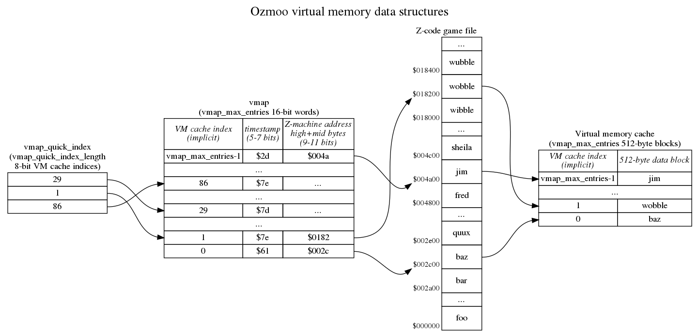

<!-- pandoc vmem.md -o vmem.pdf -->
Description of the virtual memory
=================================

12 October 2020: written by Steven Flintham, with additions and corrections by Fredrik Ramsberg and Johan Berntsson.



The basics
----------

The virtual memory subsystem is only used for the game's static and high memory, which are read-only. The game's dynamic memory is always held entirely in RAM.

The virtual memory code does most of its work in the read_byte_at_z_address subroutine. (This can be seen in vmem.asm; there are multiple versions of this subroutine in the file because conditional assembly is used to allow non-VM builds, but the VM version starts about halfway down.) It's entered with a 24-bit Z-machine address in A, X and Y (high byte in A, middle byte in X, low byte in Y) and returns with Y=0 and mempointer (a 2-byte zero page pointer) set so that "lda (mempointer),y" returns the byte at the 24-bit address given.

Note that read_byte_at_z_address isn't called for every single read from Z-machine high and static workspace; there are subroutines layered on top of it which only call it when necessary.

Virtual memory is handled in 512-byte blocks, which are always aligned at a 512-byte boundary in the game file and in memory. This means that every VM block has a Z-machine address of the form $abcd00, and the least significant bit of d is always 0.

The VM system has a cache with vmap_max_entries 512-byte blocks of RAM to use to hold blocks read from disc. There's a parallel data structure called the vmap with vmap_max_entries 16-bit words in to track what block of game data is in each cache block. At the most basic level, we can imagine that if block 4 of the cache contains the 512-byte block starting at $018200 in the game file, vmap[4] contains $0182.

If we want to access the byte at $018278, we round that down to the previous 512-byte boundary to get $018200 and then search through all the entries in vmap to see if any of them contain $0182. In this case, entry 4 does, so we'll set mempointer to cache_start_address+4*512+$078 and return. Where does the $078 come from? This is the low 9 bits of the address we were given, which can be though of as an offset to the byte of interest within this 512-byte block.

What if none of the vmap entries contains $0182? In that case we need to pick one to overwrite; let's say we pick entry 7. Because we only use virtual memory for read-only data, we can just read the 512-byte block at offset $018200 in the game file into memory at
cache_start_address+7\*512  (overwriting whatever was there), set vmap[7] to $0182 and return with mempointer set to cache_start_address+7\*512+$078.

At the most basic level, that's all there is to it. But in practice there are some additional details we need to take care of.

Timestamps
----------

We need to be able to make a sensible decision about which cache block we're going to overwrite when we need to read a block of data in from disc because it's not in the cache. What we want to do is keep hold of cache blocks we've recently used, and instead discard a block we haven't used in a while, on the reasonable assumption that we're more likely to use a block in the near future if we've recently used it.

To implement this, each vmap entry also contains a timestamp. There's a global "current time", called vmem_tick, and every time we access a cached block its timestamp is set to vmem_tick. vmem_tick is incremented whenever we need to read data from disc because it's not in the cache. Note that several entries in the vmap can therefore share the same timestamp - if we access cache blocks 4, 8 and 22 without needing to read anything from disc, all of those will have the same timestamp (the current value of vmem_tick).

Also, there's a mechanism to keep vmem_ticks from getting too big for the space available. For a z3 game, we have 7 bits for storing tick values for each vmem block. We start with the value 0 and we can just increase it until we reach 127. When we hit 128, we change the tick counter to 64, and we reduce the tick value in all vmem blocks by 64. Since we're using unsigned numbers here, a block which had the tick value 27 now gets 0. A block which had tick value 100 now gets 36 etc. The next block we read from disk gets the tick value 64, the next after that gets 65 etc. Next time we reach 128, we just repeat the above procedure. 

With that infrastructure in place, when we need to overwrite a block in the cache with a new block from disc, we can pick a block with the oldest timestamp. (Not *the* block with the oldest timestamp, because as noted above several blocks can share the same timestamp.) There's one caveat, which is that if the Z-machine program counter is currently pointing into a cache block, it is exempt from being overwritten - it would obviously be a bad thing to overwrite the instructions currently being executed with some arbitrary data! I won't go into too much detail on this here, because it's probably best discussed in the context of the routines layered on top of read_byte_at_z_address.

The timestamps are packed into the high bits of the 16-bit entries in vmap, with the low bits representing the high and mid bytes of the Z-machine address. For Z3 games, where Z-machine addresses only have 17 bits (a maximum game size of 128K), only 9 bits of the vmap entry are needed for the high and mid bytes of the address and 7 bits are available for the timestamp. Larger versions of the Z-machine need more bits for the high and mid bytes so fewer bits are available for the timestamp; a Z8 game (with 19 bit addresses for a maximum game size of 512K) only has 5 bits available for the timestamp. This limited timestamp resolution is probably why vmem_tick is only incremented when a block needs to be read from disc, not every time read_byte_from_z_address is called.

vmem_tick is actually held in memory "pre-shifted" for convenience of using it to compare or update the high byte of the 16-bit entries in vmap, so rather than incrementing by 1 at a time, it increments by 2 at a time for Z3 games, 8 at a time for Z8 games and 4 for everything else. (In the code, the increment is a constant called vmem_tick_increment.)

The quick index
----------

In general we have to do a linear search of vmap in order to see if a particular 512-byte block of the game is already in RAM (and where in RAM it is, if it's in RAM). The vmap might contain as many as 255 entries (if we have huge amounts of sideways RAM), and it's likely to contain at least 64 entries, representing 32K of cache, so this is potentially quite slow.

It's quite likely that there's a relatively small "working set" of 512-byte blocks which we're going to be accessing over and over again. For example, maybe one 512-byte block contains a Z-machine function with a loop in, and inside that loop we call another Z-machine function which lives in a separate 512-byte block.

We therefore maintain a "quick index" containing the cache indices of the blocks we've accessed most recently. (There are vmap_quick_index_length entries in this list, which in practice means there are 6 entries.) We look at the corresponding entries in vmap first to see if those entries have the 512-byte block we're interested in, and if they do we can avoid doing the full linear search. Whenever we have to do the full vmap search, we overwrite the oldest entry in the quick index with the index we found from the full search. The quick index is effectively a circular buffer of vmap_quick_index_length entries, with vmap_next_quick_index pointing to the oldest entry.

As a consequence of this, the vmap entries pointed to by the quick index are those with the most recent timestamps.

Efficient access to vmap
------------------------

Each vmap entry is a 16-bit word, so the obvious way to store vmap would be:

```
    low byte of entry 0
    high byte of entry 0
    low byte of entry 1
    high byte of entry 1
    ...
```

The disadvantage of this is that when we're using index registers to step through vmap, we need to do double increment (or decrement) operations:

```
    ldy #0
.loop
    lda vmap,y ; get low byte of entry
    lda vmap+1,y ; get high byte of entry
    ...
    iny
    iny
    cpy #max_entries*2
    bne loop
```

We don't actually need the two bytes to be adjacent in memory, and so instead we have two separate tables. vmap_z_l stores the low bytes:

```
    low byte of entry 0
    low byte of entry 1
    ...
```

and vmap_z_h stores the high bytes in the same way.

With this arrangement, we don't need double increments (or decrements) to step through the table:

```
    ldy #0
.loop
    lda vmap_z_l,y ; get low byte of entry
    lda vmap_z_h,y ; get high byte of entry
    ...
    iny
    cpy #max_entries
    bne loop
```

This also has the advantage that we can access up to 256 entries using our 8-bit index registers, instead of 128 entries if we had to do double increment/decrement. The Commodore 64 version of Ozmoo doesn't need this, but the Acorn sideways RAM version benefits from it and there are a couple of minor tweaks to the code to make this work. (If you know there are <128 entries, you can use dex:bpl to control looping over the table and avoid needing a cpx #255 to detect wrapping.)

Banking
-------

On the Commodore 64 there's an additional wrinkle because some blocks of RAM are hidden
behind the kernal ROM and there's a mechanism to copy those blocks of RAM into cache 
blocks in always-visible RAM when necessary. 

The first_banked_memory_page variable stored the high byte of the first 512 block of RAM 
that isn't always visible. On the C64 this is $d0, since the I/O registers are located 
from $d000, and unrestricted reading/writing to these memory position cause all kinds of
trouble.

When read_byte_at_z_address detects that we want to read data from a block under
the non-accessible memory ($d000-$ffff) then we will swap one of the blocks in the 
always-visible RAM with the non-accessible block. This is done by copy_page (in memory.asm),
which can copy the file securely from any memory position using memory banking as needed.

